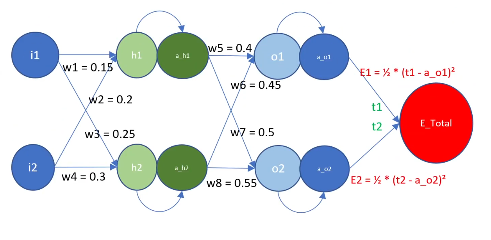
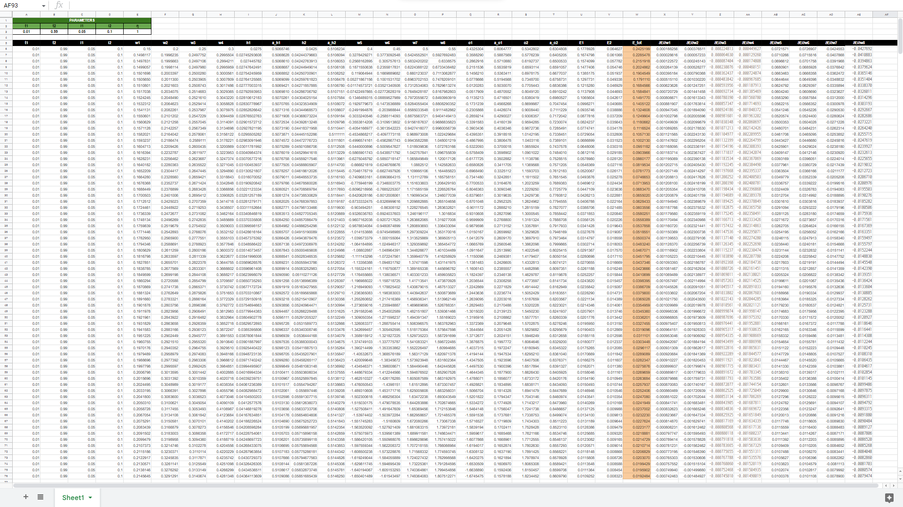
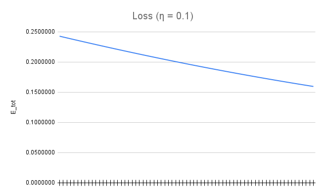
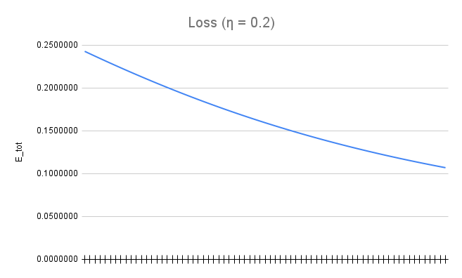
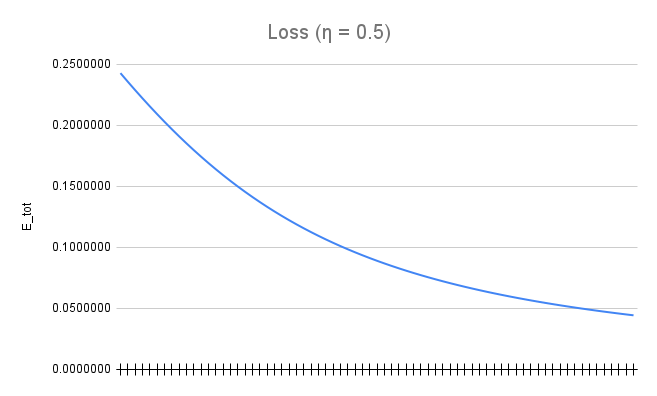
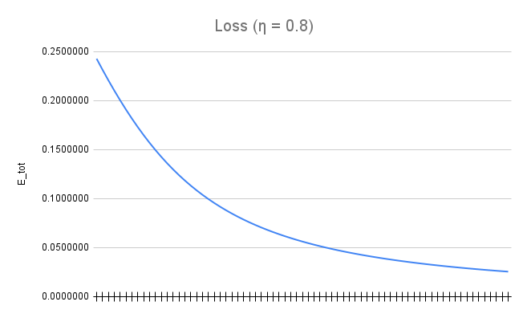
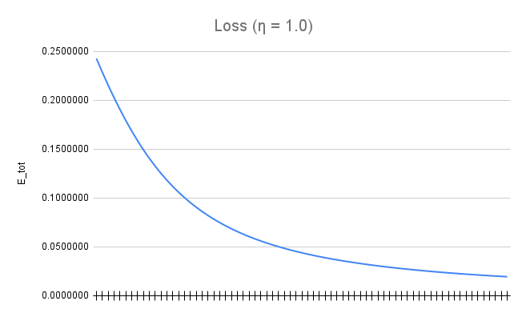
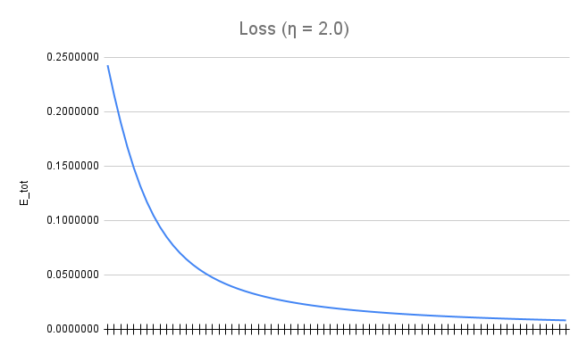

# Part 1

In part 1 of the assignment, we were given a network and we were supposed to find all the partial derivatives of loss with respect to the weights. We were also supposed to plot the loss for some number of iterations for various learning rates.

## Network



The above image shows a network with the following inputs.

```
η = Learning rate
t1 = output1 (Expected output for Input 1)
t2 = output2 (Expected output for Input 2)
i1 = Input 1
i2 = Input 2
```

Some other notations used:

```
w1 = weight 1
w2 = weight 2
w3 = weight 3
w4 = weight 4
w5 = weight 5
w6 = weight 6
w7 = weight 7
w8 = weight 8

h1 = hidden output 1
h2 = hidden output 2
a_h1 = activated hidden output 1
a_h2 = activated hidden output 2
o1 = output 1
o2 = output 2
a_o1 = activated output 1
a_o2 = activated output 2
```

Also, the loss function used is the L2 function, defined as:

```
E1 = (1/2) * (t1 - a_o1)^2
E2 = (1/2) * (t2 - a_o2)^2
```

Based on the above, we calculate the following parameters. Every parameter except the weights is initially undefined. Initial weights are chosen randomly here and these are updated in future iterations based on the gradient. Other parameters, including weights for future iterations, are derived from other parameters and input.

```
h1 = w1*i1 + w2*i2
h2 = w3*i1 + w4*i2

a_h1 = σ(h1) = 1/(1 + exp(-h1))
a_h2 = σ(h2) = 1/(1 + exp(-h2))

o1 = w5*a_h1 + w6*a_h2
o2 = w7*a_h1 + w8*a_h2

a_o1 = σ(o1) = 1/(1 + exp(-o1))
a_o2 = σ(o2) = 1/(1 + exp(-o2))

E1 = (1/2)*(t1 - a_o1)^2
E2 = (1/2)*(t2 - a_o2)^2

E_Total = E1 + E2 = E
```

Now to update weights, we need the partial differential of `E` with respect to those weights.

In short, we need the following:

```
∂E/∂w1 = ?
∂E/∂w2 = ?
∂E/∂w3 = ?
∂E/∂w4 = ?
∂E/∂w5 = ?
∂E/∂w6 = ?
∂E/∂w7 = ?
∂E/∂w8 = ?
```

Let us start from the right to left (backward) direction.

```
∂E/∂w5 = ∂(E1 + E1)/∂w5 = ∂E1/∂w5           [as E2 does not depend on w5]
∂E/∂w6 = ∂(E1 + E1)/∂w6 = ∂E1/∂w6           [as E2 does not depend on w6]
∂E/∂w7 = ∂(E1 + E1)/∂w7 = ∂E2/∂w7           [as E1 does not depend on w7]
∂E/∂w8 = ∂(E1 + E1)/∂w8 = ∂E2/∂w8           [as E1 does not depend on w8]
```

We can derive the above by chaining the differentials like:

```
∂E/∂w5 = ∂E1/∂w5 = ∂E1/∂a_o1 * ∂a_o1/∂o1 * ∂o1/∂w5               (i)
∂E/∂w6 = ∂E1/∂w6 = ∂E1/∂a_o1 * ∂a_o1/∂o1 * ∂o1/∂w6               (ii)
∂E/∂w7 = ∂E2/∂w7 = ∂E2/∂a_o2 * ∂a_o2/∂o2 * ∂o2/∂w7               (iii)
∂E/∂w8 = ∂E2/∂w8 = ∂E2/∂a_o2 * ∂a_o2/∂o2 * ∂o2/∂w8               (iv)
```

To derive `(i)`, we calculate the 3 terms in it:

```
∂E1/∂a_o1 = ∂((1/2)*(t1 - a_o1)^2)/∂a_o1 = a_o1 - t1

∂a_o1/∂o1 = ∂(σ(o1))/∂o1 = σ(o1) * (1 - σ(o1)) = a_o1 * (1 - a_o1)

∂o1/∂w5 = ∂(w5*a_h1 + w6*a_h2)/∂w5 = a_h1
```

Plugging the above in `(i)`, we get:

```
∂E/∂w5 = (a_o1 - t1) * (a_o1 * (1 - a_o1)) * a_h1
```

Similarly, to derive `(ii)`, we calculate the 3 terms in it:

```
∂E1/∂a_o1 = ∂((1/2)*(t1 - a_o1)^2)/∂a_o1 = a_o1 - t1

∂a_o1/∂o1 = ∂(σ(o1))/∂o1 = σ(o1) * (1 - σ(o1)) = a_o1 * (1 - a_o1)

∂o1/∂w6 = ∂(w5*a_h1 + w6*a_h2)/∂w6 = a_h2
```

Plugging the above in `(ii)`, we get:

```
∂E/∂w6 = (a_o1 - t1) * (a_o1 * (1 - a_o1)) * a_h2
```

Similarly, to derive `(iii)`, we calculate the 3 terms in it:

```
∂E2/∂a_o2 = ∂((1/2)*(t2 - a_o2)^2)/∂a_o1 = a_o2 - t2

∂a_o2/∂o2 = ∂(σ(o2))/∂o2 = σ(o2) * (1 - σ(o2)) = a_o2 * (1 - a_o2)

∂o2/∂w7 = ∂(w7*a_h1 + w8*a_h2)/∂w7 = a_h1
```

Plugging the above in `(iii)`, we get:

```
∂E/∂w7 = (a_o2 - t2) * (a_o2 * (1 - a_o2)) * a_h1
```

Similarly, to derive `(iv)`, we calculate the 3 terms in it:

```
∂E2/∂a_o2 = ∂((1/2)*(t2 - a_o2)^2)/∂a_o1 = a_o2 - t2

∂a_o2/∂o2 = ∂(σ(o2))/∂o2 = σ(o2) * (1 - σ(o2)) = a_o2 * (1 - a_o2)

∂o2/∂w8 = ∂(w7*a_h1 + w8*a_h2)/∂w8 = a_h2
```

Plugging the above in `(iv)`, we get:

```
∂E/∂w8 = (a_o2 - t2) * (a_o2 * (1 - a_o2)) * a_h2
```

Finally, we have our 4 of the 8 derivatives:

```
∂E/∂w5 = (a_o1 - t1) * (a_o1 * (1 - a_o1)) * a_h1
∂E/∂w6 = (a_o1 - t1) * (a_o1 * (1 - a_o1)) * a_h2
∂E/∂w7 = (a_o2 - t2) * (a_o2 * (1 - a_o2)) * a_h1
∂E/∂w8 = (a_o2 - t2) * (a_o2 * (1 - a_o2)) * a_h2
```

Similarly, we can go ahead and derive the other 4.

```
∂E/∂w1 = ∂(E1 + E2)/∂w1 = ∂E1/∂w1 + ∂E2/∂w1                     (v)
∂E/∂w2 = ∂(E1 + E2)/∂w2 = ∂E1/∂w2 + ∂E2/∂w2                     (vi)
∂E/∂w3 = ∂(E1 + E2)/∂w3 = ∂E1/∂w3 + ∂E2/∂w3                     (vii)
∂E/∂w4 = ∂(E1 + E2)/∂w4 = ∂E1/∂w4 + ∂E2/∂w4                     (viii)
```

To derive the above, we need to find the derivatives of the errors with respect to `a_h1` and `a_h2` because

```
∂E1/∂w1 = ∂E1/∂a_h1 * ∂a_h1/∂h1 * ∂h1/∂w1
∂E2/∂w1 = ∂E2/∂a_h1 * ∂a_h1/∂h1 * ∂h1/∂w1
∂E1/∂w2 = ∂E1/∂a_h1 * ∂a_h1/∂h1 * ∂h1/∂w2
∂E2/∂w2 = ∂E2/∂a_h1 * ∂a_h1/∂h1 * ∂h1/∂w2
∂E1/∂w3 = ∂E1/∂a_h2 * ∂a_h2/∂h2 * ∂h2/∂w3
∂E2/∂w3 = ∂E2/∂a_h2 * ∂a_h2/∂h2 * ∂h2/∂w3
∂E1/∂w4 = ∂E1/∂a_h2 * ∂a_h2/∂h2 * ∂h2/∂w4
∂E2/∂w4 = ∂E2/∂a_h2 * ∂a_h2/∂h2 * ∂h2/∂w4

∂E1/∂a_h1 = ∂E1/∂a_o1 * ∂a_o1/∂o1 * ∂o1/∂a_h1
          = (a_o1 - t1) * (a_o1 * (1 - a_o1)) * w5

∂E2/∂a_h1 = ∂E2/∂a_o2 * ∂a_o2/∂o2 * ∂o2/∂a_h1
          = (a_o2 - t2) * (a_o2 * (1 - a_o2)) * w7

∂E1/∂a_h2 = ∂E1/∂a_o1 * ∂a_o1/∂o1 * ∂o1/∂a_h2
          = (a_o1 - t1) * (a_o1 * (1 - a_o1)) * w6

∂E2/∂a_h2 = ∂E2/∂a_o2 * ∂a_o2/∂o2 * ∂o2/∂a_h2
          = (a_o2 - t2) * (a_o2 * (1 - a_o2)) * w8
```

Using the above equations, we can derive `∂E/∂a_h1` and `∂E/∂a_h2` (simple addition):

```
∂E/∂a_h1 = ∂E1/∂a_ah1 + ∂E2/∂a_h1
         = ((a_o1 - t1) * (a_o1 * (1 - a_o1)) * w5) + ((a_o2 - t2) * (a_o2 * (1 - a_o2)) * w7)

∂E/∂a_h2 = ∂E1/∂a_ah2 + ∂E2/∂a_h2
         = ((a_o1 - t1) * (a_o1 * (1 - a_o1)) * w6) + ((a_o2 - t2) * (a_o2 * (1 - a_o2)) * w8)
```

Now we can finally get the desired derivatives with respect to the weights.

```
∂E/∂w1 = ∂E/∂a_h1 * ∂a_h1/∂h1 * ∂h1/∂w1
       = [((a_o1 - t1) * (a_o1 * (1 - a_o1)) * w5) + ((a_o2 - t2) * (a_o2 * (1 - a_o2)) * w7)] * a_h1 * (1 - a_h1) * i1

∂E/∂w2 = ∂E/∂a_h1 * ∂a_h1/∂h1 * ∂h1/∂w2
       = [((a_o1 - t1) * (a_o1 * (1 - a_o1)) * w5) + ((a_o2 - t2) * (a_o2 * (1 - a_o2)) * w7)] * a_h1 * (1 - a_h1) * i2

∂E/∂w3 = ∂E/∂a_h2 * ∂a_h2/∂h2 * ∂h2/∂w3
       = [((a_o1 - t1) * (a_o1 * (1 - a_o1)) * w6) + ((a_o2 - t2) * (a_o2 * (1 - a_o2)) * w8)] * a_h2 * (1 - a_h2) * i1

∂E/∂w4 = ∂E/∂a_h2 * ∂a_h2/∂h2 * ∂h2/∂w4
       = [((a_o1 - t1) * (a_o1 * (1 - a_o1)) * w6) + ((a_o2 - t2) * (a_o2 * (1 - a_o2)) * w8)] * a_h2 * (1 - a_h2) * i2
```

The final equations of derivative of error with respect to weights are:

```
∂E/∂w1 = [((a_o1 - t1) * (a_o1 * (1 - a_o1)) * w5) + ((a_o2 - t2) * (a_o2 * (1 - a_o2)) * w7)] * a_h1 * (1 - a_h1) * i1

∂E/∂w2 = [((a_o1 - t1) * (a_o1 * (1 - a_o1)) * w5) + ((a_o2 - t2) * (a_o2 * (1 - a_o2)) * w7)] * a_h1 * (1 - a_h1) * i2

∂E/∂w3 = [((a_o1 - t1) * (a_o1 * (1 - a_o1)) * w6) + ((a_o2 - t2) * (a_o2 * (1 - a_o2)) * w8)] * a_h2 * (1 - a_h2) * i1

∂E/∂w4 = [((a_o1 - t1) * (a_o1 * (1 - a_o1)) * w6) + ((a_o2 - t2) * (a_o2 * (1 - a_o2)) * w8)] * a_h2 * (1 - a_h2) * i2

∂E/∂w5 = (a_o1 - t1) * (a_o1 * (1 - a_o1)) * a_h1

∂E/∂w6 = (a_o1 - t1) * (a_o1 * (1 - a_o1)) * a_h2

∂E/∂w7 = (a_o2 - t2) * (a_o2 * (1 - a_o2)) * a_h1

∂E/∂w8 = (a_o2 - t2) * (a_o2 * (1 - a_o2)) * a_h2
```

Now, we know the gradient. All that's left to do is update the individual weights. For this, we multiply learning rate with the gradient with respect to the weight and subtract the result from that weight.

So, new weights would be calculated as:

```
w1 = w1 - η * ∂E/∂w1
w2 = w2 - η * ∂E/∂w2
w3 = w3 - η * ∂E/∂w3
w4 = w4 - η * ∂E/∂w4
w5 = w5 - η * ∂E/∂w5
w6 = w6 - η * ∂E/∂w6
w7 = w7 - η * ∂E/∂w7
w8 = w8 - η * ∂E/∂w8
```

We keep doing this to reduce the total error or loss.

See the screenshot of the spreadsheet using the above formulae (`η = 1`).



## Plots

### η = 0.1



### η = 0.2



### η = 0.5



### η = 0.8



### η = 1.0



### η = 2.0



<br>
<br>
<br>

# Part 2

In part 2 of the assignment, we had to refer to the following [Network](https://colab.research.google.com/drive/1uJZvJdi5VprOQHROtJIHy0mnY2afjNlx), which identifies MNIST images, and achieve the following:

- [x] 99.4% validation accuracy `Achieved in Epochs - 12, 13, 14, 16, 17, 18, 19`
- [x] Less than 20k Parameters `Total Parameters = 17,962`
- [x] Less than 20 Epochs `19 Epochs`
- [x] Usage of Batch Normalization, Dropout, Fully Connected (FC) Layer, Global Average Pooling (GAP) `Refer to the architecture`

<br>

## Architecture

```
----------------------------------------------------------------------
| Layer   | rf_in | n_in | j_in | s | p | k | rf_out | n_out | j_out |
|---------|-------|------|------|---|---|---|--------|-------|-------|
| conv1   | 1     | 28   | 1    | 1 | 0 | 5 | 5      | 24    | 1     |
| relu    | -     | -    | -    | - | - | - | -      | -     | -     |
| bn      | -     | -    | -    | - | - | - | -      | -     | -     |
| conv2   | 5     | 24   | 1    | 1 | 0 | 3 | 7      | 22    | 1     |
| relu    | -     | -    | -    | - | - | - | -      | -     | -     |
| bn      | -     | -    | -    | - | - | - | -      | -     | -     |
| maxpool | 7     | 22   | 1    | 2 | 0 | 2 | 8      | 11    | 2     |
| drop    | -     | -    | -    | - | - | - | -      | -     | -     |
| conv3   | 8     | 11   | 2    | 1 | 0 | 3 | 12     | 9     | 2     |
| relu    | -     | -    | -    | - | - | - | -      | -     | -     |
| bn      | -     | -    | -    | - | - | - | -      | -     | -     |
| conv4   | 12    | 9    | 2    | 1 | 0 | 3 | 16     | 7     | 2     |
| relu    | -     | -    | -    | - | - | - | -      | -     | -     |
| bn      | -     | -    | -    | - | - | - | -      | -     | -     |
| gap     | -     | -    | -    | - | - | - | -      | -     | -     |
| drop    | -     | -    | -    | - | - | - | -      | -     | -     |
| fc      | -     | -    | -    | - | - | - | -      | -     | -     |
----------------------------------------------------------------------

Final RF = 16
```

## Summary

```
==========================================================================================
Layer (type:depth-idx)                   Output Shape              Param #
==========================================================================================
Net                                      [1, 10]                   --
├─Conv2d: 1-1                            [1, 32, 24, 24]           832
├─BatchNorm2d: 1-2                       [1, 32, 24, 24]           64
├─Conv2d: 1-3                            [1, 16, 22, 22]           4,624
├─BatchNorm2d: 1-4                       [1, 16, 22, 22]           32
├─Dropout: 1-5                           [1, 16, 11, 11]           --
├─Conv2d: 1-6                            [1, 16, 9, 9]             2,320
├─BatchNorm2d: 1-7                       [1, 16, 9, 9]             32
├─Conv2d: 1-8                            [1, 64, 7, 7]             9,280
├─BatchNorm2d: 1-9                       [1, 64, 7, 7]             128
├─AdaptiveAvgPool2d: 1-10                [1, 64, 1, 1]             --
├─Dropout: 1-11                          [1, 64, 1, 1]             --
├─Linear: 1-12                           [1, 10]                   650
==========================================================================================
Total params: 17,962
Trainable params: 17,962
Non-trainable params: 0
Total mult-adds (M): 3.36
==========================================================================================
Input size (MB): 0.00
Forward/backward pass size (MB): 0.49
Params size (MB): 0.07
Estimated Total Size (MB): 0.56
==========================================================================================
```

<br>

## Training Log

```
Epoch=1 loss=0.7818135023117065 batch_id=78: 100%|██████████| 79/79 [00:07<00:00, 11.00it/s]

Test set: Average loss: 0.6988, Accuracy: 8614/10000 (86.14%)

Epoch=2 loss=0.6411963105201721 batch_id=78: 100%|██████████| 79/79 [00:03<00:00, 21.46it/s]

Test set: Average loss: 0.2598, Accuracy: 9579/10000 (95.79%)

Epoch=3 loss=0.25512993335723877 batch_id=78: 100%|██████████| 79/79 [00:03<00:00, 21.49it/s]

Test set: Average loss: 0.1505, Accuracy: 9665/10000 (96.65%)

Epoch=4 loss=0.17269328236579895 batch_id=78: 100%|██████████| 79/79 [00:04<00:00, 18.87it/s]

Test set: Average loss: 0.1035, Accuracy: 9788/10000 (97.88%)

Epoch=5 loss=0.35884496569633484 batch_id=78: 100%|██████████| 79/79 [00:03<00:00, 21.57it/s]

Test set: Average loss: 0.0991, Accuracy: 9767/10000 (97.67%)

Epoch=6 loss=0.13317173719406128 batch_id=78: 100%|██████████| 79/79 [00:04<00:00, 17.22it/s]

Test set: Average loss: 0.0647, Accuracy: 9865/10000 (98.65%)

Epoch=7 loss=0.2865554094314575 batch_id=78: 100%|██████████| 79/79 [00:03<00:00, 21.36it/s]

Test set: Average loss: 0.0584, Accuracy: 9878/10000 (98.78%)

Epoch=8 loss=0.12529927492141724 batch_id=78: 100%|██████████| 79/79 [00:04<00:00, 17.84it/s]

Test set: Average loss: 0.0610, Accuracy: 9859/10000 (98.59%)

Epoch=9 loss=0.11400628834962845 batch_id=78: 100%|██████████| 79/79 [00:03<00:00, 21.73it/s]

Test set: Average loss: 0.0478, Accuracy: 9894/10000 (98.94%)

Epoch=10 loss=0.17284023761749268 batch_id=78: 100%|██████████| 79/79 [00:03<00:00, 20.40it/s]

Test set: Average loss: 0.0393, Accuracy: 9919/10000 (99.19%)

Epoch=11 loss=0.03258098289370537 batch_id=78: 100%|██████████| 79/79 [00:03<00:00, 21.53it/s]

Test set: Average loss: 0.0341, Accuracy: 9938/10000 (99.38%)

Epoch=12 loss=0.033750422298908234 batch_id=78: 100%|██████████| 79/79 [00:03<00:00, 21.41it/s]

Test set: Average loss: 0.0297, Accuracy: 9951/10000 (99.51%)

Epoch=13 loss=0.08527274429798126 batch_id=78: 100%|██████████| 79/79 [00:04<00:00, 18.57it/s]

Test set: Average loss: 0.0286, Accuracy: 9949/10000 (99.49%)

Epoch=14 loss=0.06614154577255249 batch_id=78: 100%|██████████| 79/79 [00:03<00:00, 21.80it/s]

Test set: Average loss: 0.0293, Accuracy: 9944/10000 (99.44%)

Epoch=15 loss=0.33717823028564453 batch_id=78: 100%|██████████| 79/79 [00:05<00:00, 15.55it/s]

Test set: Average loss: 0.0591, Accuracy: 9824/10000 (98.24%)

Epoch=16 loss=0.02594837173819542 batch_id=78: 100%|██████████| 79/79 [00:03<00:00, 21.69it/s]

Test set: Average loss: 0.0243, Accuracy: 9959/10000 (99.59%)

Epoch=17 loss=0.039352141320705414 batch_id=78: 100%|██████████| 79/79 [00:04<00:00, 19.13it/s]

Test set: Average loss: 0.0209, Accuracy: 9963/10000 (99.63%)

Epoch=18 loss=0.01776367798447609 batch_id=78: 100%|██████████| 79/79 [00:03<00:00, 21.52it/s]

Test set: Average loss: 0.0258, Accuracy: 9950/10000 (99.50%)

Epoch=19 loss=0.028158485889434814 batch_id=78: 100%|██████████| 79/79 [00:03<00:00, 21.98it/s]

Test set: Average loss: 0.0172, Accuracy: 9979/10000 (99.79%)
```

## Solution

Check out the file: `S6.ipynb`
<br>
