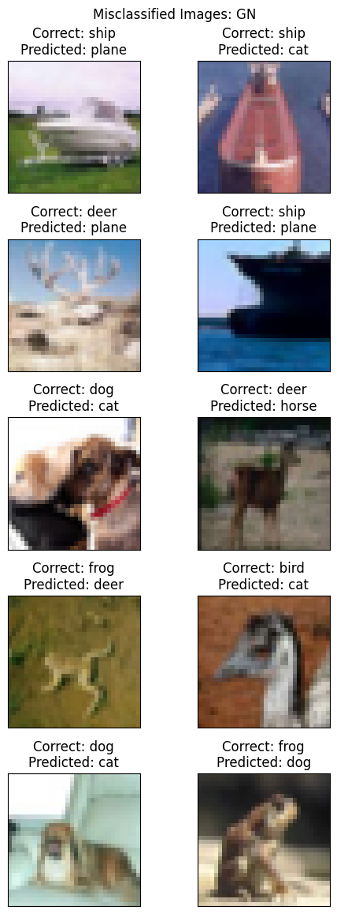

# Objectives

1. Change the dataset to CIFAR10
2. Make this network:
   - C1 C2 c3 P1 C3 C4 C5 c6 P2 C7 C8 C9 GAP c10
     - cN is 1x1 layer
   - Keep the parameter count less than 50,000
   - Max Epochs is 20
3. You are making 3 versions of the above code (in each case achieve above 70% accuracy):
   - Network with Group Normalization
   - Network with Layer Normalization
   - Network with Batch Normalization
4. Share these details
   - Training accuracy for 3 models
   - Test accuracy for 3 models
5. Find 10 misclassified images for the BN model, and show them as a 5x2 image matrix in 3 separately annotated images.
6. Write an explanatory README file that explains:
   - what is your code all about,
   - your findings for normalization techniques,
   - add all your graphs
   - your collection-of-misclassified-images
7. Upload your complete assignment on GitHub and share the link on LMS

<br>

# Code Overview

The code is structured as follows:

1. `model.py`: file which contains the model used (`Session08Model`). It expects the following arguments:
   - `norm_method: NormalizationMethod = NormalizationMethod.BATCH`: The choice of normalization to use.
   - `add_skip: bool = False`: Whether to add skip connections or not.
2. `trainer.py`: Trainer class which has methods to train the model.
3. `tester.py`: Tester class which has methods to test the model.
4. `dataloader.py`: It contains the `Cifar10DataLoader` class which is used to get train and test loaders.
5. `utils.py`: Utility functions used to plot graphs, visualize images etc.

# Transforms

- Train transforms
  - Random Horizontal Flip
  - Image normalization
- Test transforms
  - Image normalization

# Normalizations

- Batch Normalization
- Group Normalization (# Groups = 8)
- Layer Normalization

<hr>

# Model Architectures

## With Batch Normalization

```
==================================================================================================================================
Layer (type (var_name))                  Kernel Shape       Input Shape        Output Shape       Param #            Trainable
==================================================================================================================================
Session08Model (Session08Model)          --                 [2, 3, 32, 32]     [2, 10]            --                 True
├─ConvBlock (conv_block1)                --                 [2, 3, 32, 32]     [2, 24, 32, 32]    --                 True
│    └─Sequential (block)                --                 [2, 3, 32, 32]     [2, 24, 32, 32]    --                 True
│    │    └─ConvLayer (0)                --                 [2, 3, 32, 32]     [2, 24, 32, 32]    --                 True
│    │    │    └─Conv2d (conv)           [3, 3]             [2, 3, 32, 32]     [2, 24, 32, 32]    648                True
│    │    │    └─BatchNorm2d (norm)      --                 [2, 24, 32, 32]    [2, 24, 32, 32]    48                 True
│    │    │    └─ReLU (activation)       --                 [2, 24, 32, 32]    [2, 24, 32, 32]    --                 --
│    │    │    └─Dropout (drop)          --                 [2, 24, 32, 32]    [2, 24, 32, 32]    --                 --
│    │    └─ConvLayer (1)                --                 [2, 24, 32, 32]    [2, 24, 32, 32]    --                 True
│    │    │    └─Conv2d (conv)           [3, 3]             [2, 24, 32, 32]    [2, 24, 32, 32]    5,184              True
│    │    │    └─BatchNorm2d (norm)      --                 [2, 24, 32, 32]    [2, 24, 32, 32]    48                 True
│    │    │    └─ReLU (activation)       --                 [2, 24, 32, 32]    [2, 24, 32, 32]    --                 --
│    │    │    └─Dropout (drop)          --                 [2, 24, 32, 32]    [2, 24, 32, 32]    --                 --
├─TransBlock (trans_block1)              --                 [2, 24, 32, 32]    [2, 16, 16, 16]    --                 True
│    └─Sequential (layer)                --                 [2, 24, 32, 32]    [2, 16, 16, 16]    --                 True
│    │    └─Conv2d (0)                   [1, 1]             [2, 24, 32, 32]    [2, 16, 32, 32]    384                True
│    │    └─MaxPool2d (1)                [2, 2]             [2, 16, 32, 32]    [2, 16, 16, 16]    --                 --
├─ConvBlock (conv_block2)                --                 [2, 16, 16, 16]    [2, 24, 16, 16]    --                 True
│    └─Sequential (block)                --                 [2, 16, 16, 16]    [2, 24, 16, 16]    --                 True
│    │    └─ConvLayer (0)                --                 [2, 16, 16, 16]    [2, 24, 16, 16]    --                 True
│    │    │    └─Conv2d (conv)           [3, 3]             [2, 16, 16, 16]    [2, 24, 16, 16]    3,456              True
│    │    │    └─BatchNorm2d (norm)      --                 [2, 24, 16, 16]    [2, 24, 16, 16]    48                 True
│    │    │    └─ReLU (activation)       --                 [2, 24, 16, 16]    [2, 24, 16, 16]    --                 --
│    │    │    └─Dropout (drop)          --                 [2, 24, 16, 16]    [2, 24, 16, 16]    --                 --
│    │    └─ConvLayer (1)                --                 [2, 24, 16, 16]    [2, 24, 16, 16]    --                 True
│    │    │    └─Conv2d (conv)           [3, 3]             [2, 24, 16, 16]    [2, 24, 16, 16]    5,184              True
│    │    │    └─BatchNorm2d (norm)      --                 [2, 24, 16, 16]    [2, 24, 16, 16]    48                 True
│    │    │    └─ReLU (activation)       --                 [2, 24, 16, 16]    [2, 24, 16, 16]    --                 --
│    │    │    └─Dropout (drop)          --                 [2, 24, 16, 16]    [2, 24, 16, 16]    --                 --
│    │    └─ConvLayer (2)                --                 [2, 24, 16, 16]    [2, 24, 16, 16]    --                 True
│    │    │    └─Conv2d (conv)           [3, 3]             [2, 24, 16, 16]    [2, 24, 16, 16]    5,184              True
│    │    │    └─BatchNorm2d (norm)      --                 [2, 24, 16, 16]    [2, 24, 16, 16]    48                 True
│    │    │    └─ReLU (activation)       --                 [2, 24, 16, 16]    [2, 24, 16, 16]    --                 --
│    │    │    └─Dropout (drop)          --                 [2, 24, 16, 16]    [2, 24, 16, 16]    --                 --
├─TransBlock (trans_block2)              --                 [2, 24, 16, 16]    [2, 16, 8, 8]      --                 True
│    └─Sequential (layer)                --                 [2, 24, 16, 16]    [2, 16, 8, 8]      --                 True
│    │    └─Conv2d (0)                   [1, 1]             [2, 24, 16, 16]    [2, 16, 16, 16]    384                True
│    │    └─MaxPool2d (1)                [2, 2]             [2, 16, 16, 16]    [2, 16, 8, 8]      --                 --
├─ConvBlock (conv_block3)                --                 [2, 16, 8, 8]      [2, 24, 8, 8]      --                 True
│    └─Sequential (block)                --                 [2, 16, 8, 8]      [2, 24, 8, 8]      --                 True
│    │    └─ConvLayer (0)                --                 [2, 16, 8, 8]      [2, 24, 8, 8]      --                 True
│    │    │    └─Conv2d (conv)           [3, 3]             [2, 16, 8, 8]      [2, 24, 8, 8]      3,456              True
│    │    │    └─BatchNorm2d (norm)      --                 [2, 24, 8, 8]      [2, 24, 8, 8]      48                 True
│    │    │    └─ReLU (activation)       --                 [2, 24, 8, 8]      [2, 24, 8, 8]      --                 --
│    │    │    └─Dropout (drop)          --                 [2, 24, 8, 8]      [2, 24, 8, 8]      --                 --
│    │    └─ConvLayer (1)                --                 [2, 24, 8, 8]      [2, 24, 8, 8]      --                 True
│    │    │    └─Conv2d (conv)           [3, 3]             [2, 24, 8, 8]      [2, 24, 8, 8]      5,184              True
│    │    │    └─BatchNorm2d (norm)      --                 [2, 24, 8, 8]      [2, 24, 8, 8]      48                 True
│    │    │    └─ReLU (activation)       --                 [2, 24, 8, 8]      [2, 24, 8, 8]      --                 --
│    │    │    └─Dropout (drop)          --                 [2, 24, 8, 8]      [2, 24, 8, 8]      --                 --
│    │    └─ConvLayer (2)                --                 [2, 24, 8, 8]      [2, 24, 8, 8]      --                 True
│    │    │    └─Conv2d (conv)           [3, 3]             [2, 24, 8, 8]      [2, 24, 8, 8]      5,184              True
│    │    │    └─BatchNorm2d (norm)      --                 [2, 24, 8, 8]      [2, 24, 8, 8]      48                 True
│    │    │    └─ReLU (activation)       --                 [2, 24, 8, 8]      [2, 24, 8, 8]      --                 --
│    │    │    └─Dropout (drop)          --                 [2, 24, 8, 8]      [2, 24, 8, 8]      --                 --
├─Sequential (output_block)              --                 [2, 24, 8, 8]      [2, 10]            --                 True
│    └─AdaptiveAvgPool2d (0)             --                 [2, 24, 8, 8]      [2, 24, 1, 1]      --                 --
│    └─Conv2d (1)                        [1, 1]             [2, 24, 1, 1]      [2, 10, 1, 1]      240                True
│    └─Flatten (2)                       --                 [2, 10, 1, 1]      [2, 10]            --                 --
│    └─LogSoftmax (3)                    --                 [2, 10]            [2, 10]            --                 --
==================================================================================================================================
Total params: 34,872
Trainable params: 34,872
Non-trainable params: 0
Total mult-adds (M): 21.78
==================================================================================================================================
Input size (MB): 0.02
Forward/backward pass size (MB): 2.64
Params size (MB): 0.14
Estimated Total Size (MB): 2.80
==================================================================================================================================
```

## With Group Normalization

```
==================================================================================================================================
Layer (type (var_name))                  Kernel Shape       Input Shape        Output Shape       Param #            Trainable
==================================================================================================================================
Session08Model (Session08Model)          --                 [2, 3, 32, 32]     [2, 10]            --                 True
├─ConvBlock (conv_block1)                --                 [2, 3, 32, 32]     [2, 24, 32, 32]    --                 True
│    └─Sequential (block)                --                 [2, 3, 32, 32]     [2, 24, 32, 32]    --                 True
│    │    └─ConvLayer (0)                --                 [2, 3, 32, 32]     [2, 24, 32, 32]    --                 True
│    │    │    └─Conv2d (conv)           [3, 3]             [2, 3, 32, 32]     [2, 24, 32, 32]    648                True
│    │    │    └─GroupNorm (norm)        --                 [2, 24, 32, 32]    [2, 24, 32, 32]    48                 True
│    │    │    └─ReLU (activation)       --                 [2, 24, 32, 32]    [2, 24, 32, 32]    --                 --
│    │    │    └─Dropout (drop)          --                 [2, 24, 32, 32]    [2, 24, 32, 32]    --                 --
│    │    └─ConvLayer (1)                --                 [2, 24, 32, 32]    [2, 24, 32, 32]    --                 True
│    │    │    └─Conv2d (conv)           [3, 3]             [2, 24, 32, 32]    [2, 24, 32, 32]    5,184              True
│    │    │    └─GroupNorm (norm)        --                 [2, 24, 32, 32]    [2, 24, 32, 32]    48                 True
│    │    │    └─ReLU (activation)       --                 [2, 24, 32, 32]    [2, 24, 32, 32]    --                 --
│    │    │    └─Dropout (drop)          --                 [2, 24, 32, 32]    [2, 24, 32, 32]    --                 --
├─TransBlock (trans_block1)              --                 [2, 24, 32, 32]    [2, 16, 16, 16]    --                 True
│    └─Sequential (layer)                --                 [2, 24, 32, 32]    [2, 16, 16, 16]    --                 True
│    │    └─Conv2d (0)                   [1, 1]             [2, 24, 32, 32]    [2, 16, 32, 32]    384                True
│    │    └─MaxPool2d (1)                [2, 2]             [2, 16, 32, 32]    [2, 16, 16, 16]    --                 --
├─ConvBlock (conv_block2)                --                 [2, 16, 16, 16]    [2, 24, 16, 16]    --                 True
│    └─Sequential (block)                --                 [2, 16, 16, 16]    [2, 24, 16, 16]    --                 True
│    │    └─ConvLayer (0)                --                 [2, 16, 16, 16]    [2, 24, 16, 16]    --                 True
│    │    │    └─Conv2d (conv)           [3, 3]             [2, 16, 16, 16]    [2, 24, 16, 16]    3,456              True
│    │    │    └─GroupNorm (norm)        --                 [2, 24, 16, 16]    [2, 24, 16, 16]    48                 True
│    │    │    └─ReLU (activation)       --                 [2, 24, 16, 16]    [2, 24, 16, 16]    --                 --
│    │    │    └─Dropout (drop)          --                 [2, 24, 16, 16]    [2, 24, 16, 16]    --                 --
│    │    └─ConvLayer (1)                --                 [2, 24, 16, 16]    [2, 24, 16, 16]    --                 True
│    │    │    └─Conv2d (conv)           [3, 3]             [2, 24, 16, 16]    [2, 24, 16, 16]    5,184              True
│    │    │    └─GroupNorm (norm)        --                 [2, 24, 16, 16]    [2, 24, 16, 16]    48                 True
│    │    │    └─ReLU (activation)       --                 [2, 24, 16, 16]    [2, 24, 16, 16]    --                 --
│    │    │    └─Dropout (drop)          --                 [2, 24, 16, 16]    [2, 24, 16, 16]    --                 --
│    │    └─ConvLayer (2)                --                 [2, 24, 16, 16]    [2, 24, 16, 16]    --                 True
│    │    │    └─Conv2d (conv)           [3, 3]             [2, 24, 16, 16]    [2, 24, 16, 16]    5,184              True
│    │    │    └─GroupNorm (norm)        --                 [2, 24, 16, 16]    [2, 24, 16, 16]    48                 True
│    │    │    └─ReLU (activation)       --                 [2, 24, 16, 16]    [2, 24, 16, 16]    --                 --
│    │    │    └─Dropout (drop)          --                 [2, 24, 16, 16]    [2, 24, 16, 16]    --                 --
├─TransBlock (trans_block2)              --                 [2, 24, 16, 16]    [2, 16, 8, 8]      --                 True
│    └─Sequential (layer)                --                 [2, 24, 16, 16]    [2, 16, 8, 8]      --                 True
│    │    └─Conv2d (0)                   [1, 1]             [2, 24, 16, 16]    [2, 16, 16, 16]    384                True
│    │    └─MaxPool2d (1)                [2, 2]             [2, 16, 16, 16]    [2, 16, 8, 8]      --                 --
├─ConvBlock (conv_block3)                --                 [2, 16, 8, 8]      [2, 24, 8, 8]      --                 True
│    └─Sequential (block)                --                 [2, 16, 8, 8]      [2, 24, 8, 8]      --                 True
│    │    └─ConvLayer (0)                --                 [2, 16, 8, 8]      [2, 24, 8, 8]      --                 True
│    │    │    └─Conv2d (conv)           [3, 3]             [2, 16, 8, 8]      [2, 24, 8, 8]      3,456              True
│    │    │    └─GroupNorm (norm)        --                 [2, 24, 8, 8]      [2, 24, 8, 8]      48                 True
│    │    │    └─ReLU (activation)       --                 [2, 24, 8, 8]      [2, 24, 8, 8]      --                 --
│    │    │    └─Dropout (drop)          --                 [2, 24, 8, 8]      [2, 24, 8, 8]      --                 --
│    │    └─ConvLayer (1)                --                 [2, 24, 8, 8]      [2, 24, 8, 8]      --                 True
│    │    │    └─Conv2d (conv)           [3, 3]             [2, 24, 8, 8]      [2, 24, 8, 8]      5,184              True
│    │    │    └─GroupNorm (norm)        --                 [2, 24, 8, 8]      [2, 24, 8, 8]      48                 True
│    │    │    └─ReLU (activation)       --                 [2, 24, 8, 8]      [2, 24, 8, 8]      --                 --
│    │    │    └─Dropout (drop)          --                 [2, 24, 8, 8]      [2, 24, 8, 8]      --                 --
│    │    └─ConvLayer (2)                --                 [2, 24, 8, 8]      [2, 24, 8, 8]      --                 True
│    │    │    └─Conv2d (conv)           [3, 3]             [2, 24, 8, 8]      [2, 24, 8, 8]      5,184              True
│    │    │    └─GroupNorm (norm)        --                 [2, 24, 8, 8]      [2, 24, 8, 8]      48                 True
│    │    │    └─ReLU (activation)       --                 [2, 24, 8, 8]      [2, 24, 8, 8]      --                 --
│    │    │    └─Dropout (drop)          --                 [2, 24, 8, 8]      [2, 24, 8, 8]      --                 --
├─Sequential (output_block)              --                 [2, 24, 8, 8]      [2, 10]            --                 True
│    └─AdaptiveAvgPool2d (0)             --                 [2, 24, 8, 8]      [2, 24, 1, 1]      --                 --
│    └─Conv2d (1)                        [1, 1]             [2, 24, 1, 1]      [2, 10, 1, 1]      240                True
│    └─Flatten (2)                       --                 [2, 10, 1, 1]      [2, 10]            --                 --
│    └─LogSoftmax (3)                    --                 [2, 10]            [2, 10]            --                 --
==================================================================================================================================
Total params: 34,872
Trainable params: 34,872
Non-trainable params: 0
Total mult-adds (M): 21.78
==================================================================================================================================
Input size (MB): 0.02
Forward/backward pass size (MB): 2.64
Params size (MB): 0.14
Estimated Total Size (MB): 2.80
==================================================================================================================================
```

## With Layer Normalization

```
==================================================================================================================================
Layer (type (var_name))                  Kernel Shape       Input Shape        Output Shape       Param #            Trainable
==================================================================================================================================
Session08Model (Session08Model)          --                 [2, 3, 32, 32]     [2, 10]            --                 True
├─ConvBlock (conv_block1)                --                 [2, 3, 32, 32]     [2, 24, 32, 32]    --                 True
│    └─Sequential (block)                --                 [2, 3, 32, 32]     [2, 24, 32, 32]    --                 True
│    │    └─ConvLayer (0)                --                 [2, 3, 32, 32]     [2, 24, 32, 32]    --                 True
│    │    │    └─Conv2d (conv)           [3, 3]             [2, 3, 32, 32]     [2, 24, 32, 32]    648                True
│    │    │    └─GroupNorm (norm)        --                 [2, 24, 32, 32]    [2, 24, 32, 32]    48                 True
│    │    │    └─ReLU (activation)       --                 [2, 24, 32, 32]    [2, 24, 32, 32]    --                 --
│    │    │    └─Dropout (drop)          --                 [2, 24, 32, 32]    [2, 24, 32, 32]    --                 --
│    │    └─ConvLayer (1)                --                 [2, 24, 32, 32]    [2, 24, 32, 32]    --                 True
│    │    │    └─Conv2d (conv)           [3, 3]             [2, 24, 32, 32]    [2, 24, 32, 32]    5,184              True
│    │    │    └─GroupNorm (norm)        --                 [2, 24, 32, 32]    [2, 24, 32, 32]    48                 True
│    │    │    └─ReLU (activation)       --                 [2, 24, 32, 32]    [2, 24, 32, 32]    --                 --
│    │    │    └─Dropout (drop)          --                 [2, 24, 32, 32]    [2, 24, 32, 32]    --                 --
├─TransBlock (trans_block1)              --                 [2, 24, 32, 32]    [2, 16, 16, 16]    --                 True
│    └─Sequential (layer)                --                 [2, 24, 32, 32]    [2, 16, 16, 16]    --                 True
│    │    └─Conv2d (0)                   [1, 1]             [2, 24, 32, 32]    [2, 16, 32, 32]    384                True
│    │    └─MaxPool2d (1)                [2, 2]             [2, 16, 32, 32]    [2, 16, 16, 16]    --                 --
├─ConvBlock (conv_block2)                --                 [2, 16, 16, 16]    [2, 24, 16, 16]    --                 True
│    └─Sequential (block)                --                 [2, 16, 16, 16]    [2, 24, 16, 16]    --                 True
│    │    └─ConvLayer (0)                --                 [2, 16, 16, 16]    [2, 24, 16, 16]    --                 True
│    │    │    └─Conv2d (conv)           [3, 3]             [2, 16, 16, 16]    [2, 24, 16, 16]    3,456              True
│    │    │    └─GroupNorm (norm)        --                 [2, 24, 16, 16]    [2, 24, 16, 16]    48                 True
│    │    │    └─ReLU (activation)       --                 [2, 24, 16, 16]    [2, 24, 16, 16]    --                 --
│    │    │    └─Dropout (drop)          --                 [2, 24, 16, 16]    [2, 24, 16, 16]    --                 --
│    │    └─ConvLayer (1)                --                 [2, 24, 16, 16]    [2, 24, 16, 16]    --                 True
│    │    │    └─Conv2d (conv)           [3, 3]             [2, 24, 16, 16]    [2, 24, 16, 16]    5,184              True
│    │    │    └─GroupNorm (norm)        --                 [2, 24, 16, 16]    [2, 24, 16, 16]    48                 True
│    │    │    └─ReLU (activation)       --                 [2, 24, 16, 16]    [2, 24, 16, 16]    --                 --
│    │    │    └─Dropout (drop)          --                 [2, 24, 16, 16]    [2, 24, 16, 16]    --                 --
│    │    └─ConvLayer (2)                --                 [2, 24, 16, 16]    [2, 24, 16, 16]    --                 True
│    │    │    └─Conv2d (conv)           [3, 3]             [2, 24, 16, 16]    [2, 24, 16, 16]    5,184              True
│    │    │    └─GroupNorm (norm)        --                 [2, 24, 16, 16]    [2, 24, 16, 16]    48                 True
│    │    │    └─ReLU (activation)       --                 [2, 24, 16, 16]    [2, 24, 16, 16]    --                 --
│    │    │    └─Dropout (drop)          --                 [2, 24, 16, 16]    [2, 24, 16, 16]    --                 --
├─TransBlock (trans_block2)              --                 [2, 24, 16, 16]    [2, 16, 8, 8]      --                 True
│    └─Sequential (layer)                --                 [2, 24, 16, 16]    [2, 16, 8, 8]      --                 True
│    │    └─Conv2d (0)                   [1, 1]             [2, 24, 16, 16]    [2, 16, 16, 16]    384                True
│    │    └─MaxPool2d (1)                [2, 2]             [2, 16, 16, 16]    [2, 16, 8, 8]      --                 --
├─ConvBlock (conv_block3)                --                 [2, 16, 8, 8]      [2, 24, 8, 8]      --                 True
│    └─Sequential (block)                --                 [2, 16, 8, 8]      [2, 24, 8, 8]      --                 True
│    │    └─ConvLayer (0)                --                 [2, 16, 8, 8]      [2, 24, 8, 8]      --                 True
│    │    │    └─Conv2d (conv)           [3, 3]             [2, 16, 8, 8]      [2, 24, 8, 8]      3,456              True
│    │    │    └─GroupNorm (norm)        --                 [2, 24, 8, 8]      [2, 24, 8, 8]      48                 True
│    │    │    └─ReLU (activation)       --                 [2, 24, 8, 8]      [2, 24, 8, 8]      --                 --
│    │    │    └─Dropout (drop)          --                 [2, 24, 8, 8]      [2, 24, 8, 8]      --                 --
│    │    └─ConvLayer (1)                --                 [2, 24, 8, 8]      [2, 24, 8, 8]      --                 True
│    │    │    └─Conv2d (conv)           [3, 3]             [2, 24, 8, 8]      [2, 24, 8, 8]      5,184              True
│    │    │    └─GroupNorm (norm)        --                 [2, 24, 8, 8]      [2, 24, 8, 8]      48                 True
│    │    │    └─ReLU (activation)       --                 [2, 24, 8, 8]      [2, 24, 8, 8]      --                 --
│    │    │    └─Dropout (drop)          --                 [2, 24, 8, 8]      [2, 24, 8, 8]      --                 --
│    │    └─ConvLayer (2)                --                 [2, 24, 8, 8]      [2, 24, 8, 8]      --                 True
│    │    │    └─Conv2d (conv)           [3, 3]             [2, 24, 8, 8]      [2, 24, 8, 8]      5,184              True
│    │    │    └─GroupNorm (norm)        --                 [2, 24, 8, 8]      [2, 24, 8, 8]      48                 True
│    │    │    └─ReLU (activation)       --                 [2, 24, 8, 8]      [2, 24, 8, 8]      --                 --
│    │    │    └─Dropout (drop)          --                 [2, 24, 8, 8]      [2, 24, 8, 8]      --                 --
├─Sequential (output_block)              --                 [2, 24, 8, 8]      [2, 10]            --                 True
│    └─AdaptiveAvgPool2d (0)             --                 [2, 24, 8, 8]      [2, 24, 1, 1]      --                 --
│    └─Conv2d (1)                        [1, 1]             [2, 24, 1, 1]      [2, 10, 1, 1]      240                True
│    └─Flatten (2)                       --                 [2, 10, 1, 1]      [2, 10]            --                 --
│    └─LogSoftmax (3)                    --                 [2, 10]            [2, 10]            --                 --
==================================================================================================================================
Total params: 34,872
Trainable params: 34,872
Non-trainable params: 0
Total mult-adds (M): 21.78
==================================================================================================================================
Input size (MB): 0.02
Forward/backward pass size (MB): 2.64
Params size (MB): 0.14
Estimated Total Size (MB): 2.80
==================================================================================================================================
```

# Normalizations

## Batch Normalization (BN)

To perform BN, we calculate the mean and the variance of each channel. It does not depend on the mini-batch size. No matter how many images are in the batch, there is only 1 mean and 1 variance for each channel. The number of additional parameters depends on the number of channels.

## Group Normalization (GN)

To perform GN, we calculate the mean and the variance of each group. The grouping is of the channels. Mean and variance are calculated for each image in the mini-batch. The number of additional parameters depends on the size of the mini-batch and the number of groups.

If the size of batch is 4 and number of groups is 2 then the number of additional parameters added is 8 each for mean and variance.

## Layer Normalization (LN)

To perform LN, we calculate the mean and the variance of each image in the mini-batch across all the channels. No matter how many channels are there, there is only 1 mean and 1 variance for each image. The number of additional parameters depends on the size of the mini-batch.

<br>

# Receptive Field Calculations

| **layer** | **rf_in** | **n_in** | **j_in** | **s** | **p** | **k** | **rf_out** | **n_out** | **j_out** |
| --------- | --------- | -------- | -------- | ----- | ----- | ----- | ---------- | --------- | --------- |
| conv1     | 1         | 32       | 1        | 1     | 1     | 3     | 3          | 32        | 1         |
| conv2     | 3         | 32       | 1        | 1     | 1     | 3     | 5          | 32        | 1         |
| maxpool   | 5         | 32       | 1        | 2     | 0     | 2     | 6          | 16        | 2         |
| conv3     | 6         | 16       | 2        | 1     | 1     | 3     | 10         | 16        | 2         |
| conv4     | 10        | 16       | 2        | 1     | 1     | 3     | 14         | 16        | 2         |
| conv5     | 14        | 16       | 2        | 1     | 1     | 3     | 18         | 16        | 2         |
| maxpool   | 18        | 16       | 2        | 2     | 0     | 2     | 20         | 8         | 4         |
| conv6     | 20        | 8        | 4        | 1     | 1     | 3     | 28         | 8         | 4         |
| conv7     | 28        | 8        | 4        | 1     | 1     | 3     | 36         | 8         | 4         |
| conv8     | 36        | 8        | 4        | 1     | 1     | 3     | 44         | 8         | 4         |
| gap       | 44        | 8        | 4        | 8     | 0     | 8     | 72         | 1         | 32        |

**Note:** I ignored 1x1 convolutions as they contribute nothing to RF calculations

# Results (Batch size = 128):

- ## Batch Normalization
  - Total Parameters = 34,872
  - Best training accuracy = 78.98%
  - Best testing accuracy = 77.99%
- ## Group Normalization (# Groups = 8)
  - Total Parameters = 34,872
  - Best training accuracy = 74.03%
  - Best testing accuracy = 72.61%
- ## Layer Normalization
  - Total Parameters = 34,872
  - Best training accuracy = 72.13%
  - Best testing accuracy = 70.57%

<br>

# Analysis

## Batch normalization

- Highest training and testing accuracy as it normalizes across the whole mini-batch per channel.

## Group normalization

- It performed worse than Batch Normalization and better than Layer Normalization.
- As the number of groups increases, it provides better results.

## Layer normalization

- It performed the worst as it normalizes each image across all channels.
- This is not suitable for image classifiers.

<br>

# Misclassified images

## Batch normalization


## Group normalization



## Layer normalization


<br>

# Graphs

## Batch normalization


## Group normalization


## Layer normalization


# Solution

1. Batch normalization: `session_08_bn.ipynb`
2. Group normalization: `session_08_gn.ipynb`
3. Layer normalization: `session_08_ln.ipynb`
   <br>
