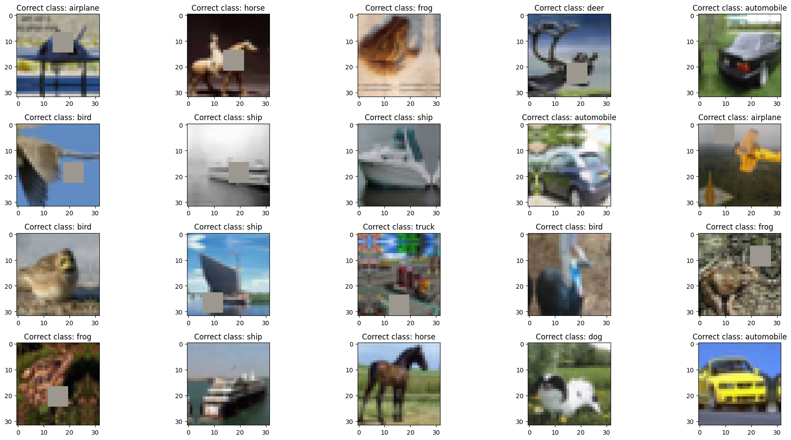
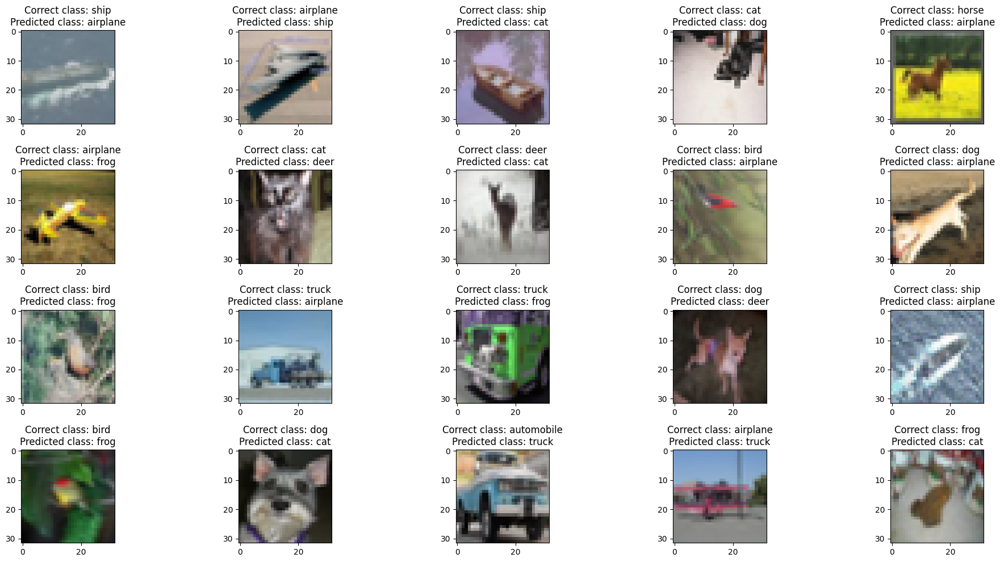
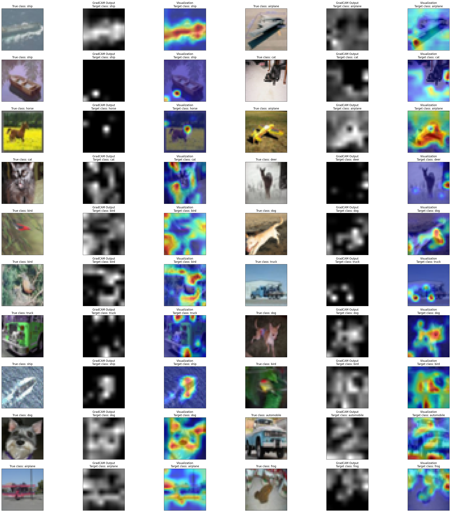
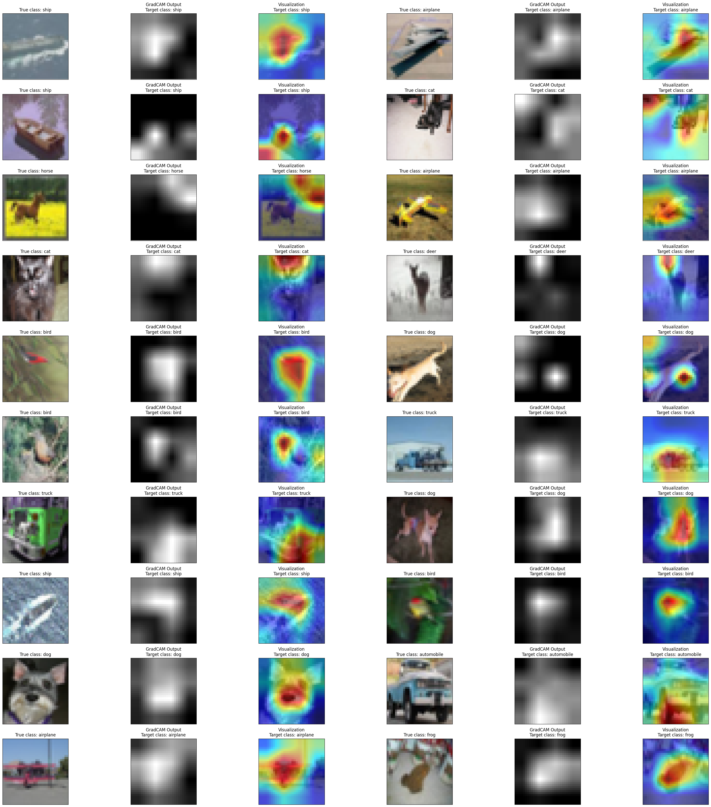
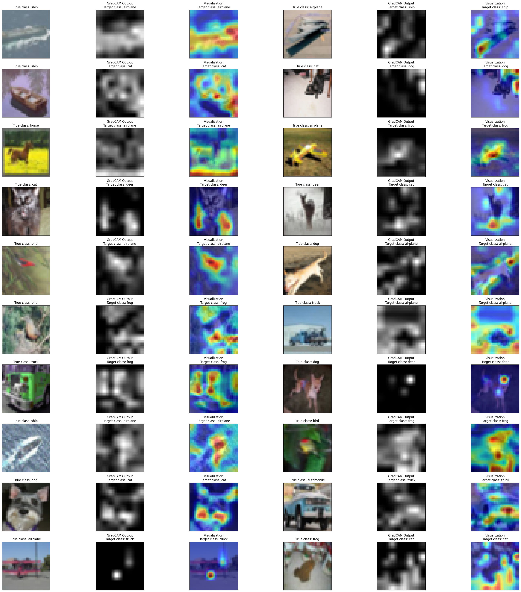
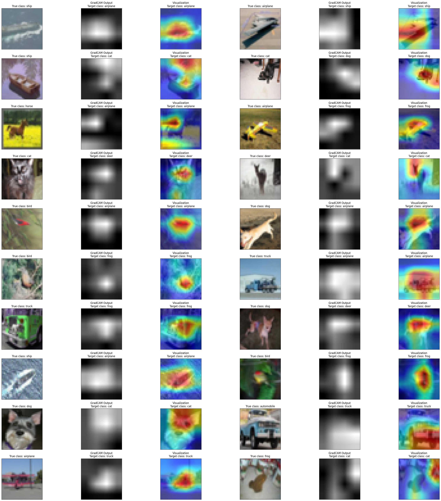
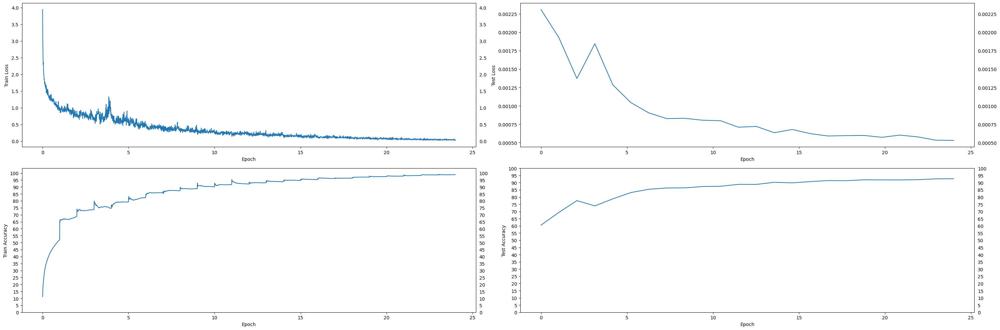
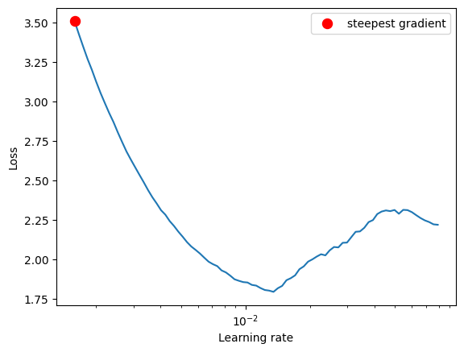
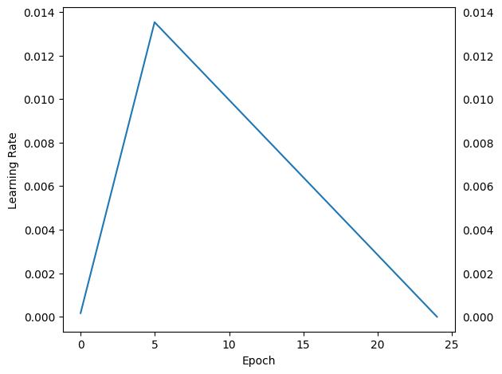

# **Assignment 10**

1.  Write a custom ResNet architecture for CIFAR10 that has the following architecture:

    - PrepLayer - Conv 3x3 (s=1, p=1) >> BN >> RELU `[out channels = 64]`
    - Layer1
      - X = Conv 3x3 (s=1, p=1) >> MaxPool2D >> BN >> RELU `[out channels = 128]`
      - R1 = ResBlock( (Conv-BN-ReLU-Conv-BN-ReLU))(X) `[out channels = 128]`
      - Add(X, R1)
    - Layer 2
      - Conv 3x3 `[out channels = 256]`
      - MaxPooling2D
      - BN
      - ReLU
    - Layer 3
      - X = Conv 3x3 (s=1, p=1) >> MaxPool2D >> BN >> RELU `[out channels = 512]`
      - R2 = ResBlock( (Conv-BN-ReLU-Conv-BN-ReLU))(X) `[out channels = 512]`
      - Add(X, R2)
    - Max Pooling with Kernel Size 4
    - FC Layer
    - SoftMax

2.  Uses One Cycle Policy such that:
    - Total Epochs = 24
    - Max at Epoch = 5
    - LRMIN = FIND
    - LRMAX = FIND
    - No Annihilation
3.  Uses these transforms

    - RandomCrop(32, 32) (after padding of 4)
    - FlipLR
    - Followed by CutOut(8, 8)

4.  Batch size = 512

5.  Use ADAM, and CrossEntropyLoss

6.  Target Accuracy: 90%

7.  No score if your code is not modular. Your collab must be importing your GitHub package, and then just running the model. I should be able to find the custom_resnet.py model in your GitHub repo that you'd be training.

8.  Once done, proceed to answer the Assignment-Solution page.

## Solution

`session_10.ipynb`

# Model Parameters

```
==============================================================================================================================================================================================
Layer (type (var_name))                  Kernel Shape              Input Shape               Output Shape              Param #                   Mult-Adds                 Trainable
==============================================================================================================================================================================================
CustomResNet (CustomResNet)              --                        [20, 3, 32, 32]           [20, 10]                  --                        --                        True
├─Sequential (prep_layer)                --                        [20, 3, 32, 32]           [20, 64, 32, 32]          --                        --                        True
│    └─Conv2d (0)                        [3, 3]                    [20, 3, 32, 32]           [20, 64, 32, 32]          1,728                     35,389,440                True
│    └─BatchNorm2d (1)                   --                        [20, 64, 32, 32]          [20, 64, 32, 32]          128                       2,560                     True
│    └─ReLU (2)                          --                        [20, 64, 32, 32]          [20, 64, 32, 32]          --                        --                        --
├─CustomBlock (layer_1)                  --                        [20, 64, 32, 32]          [20, 128, 16, 16]         --                        --                        True
│    └─Sequential (inner_layer)          --                        [20, 64, 32, 32]          [20, 128, 16, 16]         --                        --                        True
│    │    └─Conv2d (0)                   [3, 3]                    [20, 64, 32, 32]          [20, 128, 32, 32]         73,728                    1,509,949,440             True
│    │    └─MaxPool2d (1)                2                         [20, 128, 32, 32]         [20, 128, 16, 16]         --                        --                        --
│    │    └─BatchNorm2d (2)              --                        [20, 128, 16, 16]         [20, 128, 16, 16]         256                       5,120                     True
│    │    └─ReLU (3)                     --                        [20, 128, 16, 16]         [20, 128, 16, 16]         --                        --                        --
│    └─BasicBlock (res_block)            --                        [20, 128, 16, 16]         [20, 128, 16, 16]         --                        --                        True
│    │    └─Conv2d (conv1)               [3, 3]                    [20, 128, 16, 16]         [20, 128, 16, 16]         147,456                   754,974,720               True
│    │    └─BatchNorm2d (bn1)            --                        [20, 128, 16, 16]         [20, 128, 16, 16]         256                       5,120                     True
│    │    └─Conv2d (conv2)               [3, 3]                    [20, 128, 16, 16]         [20, 128, 16, 16]         147,456                   754,974,720               True
│    │    └─BatchNorm2d (bn2)            --                        [20, 128, 16, 16]         [20, 128, 16, 16]         256                       5,120                     True
│    │    └─Sequential (shortcut)        --                        [20, 128, 16, 16]         [20, 128, 16, 16]         --                        --                        --
├─Sequential (layer_2)                   --                        [20, 128, 16, 16]         [20, 256, 8, 8]           --                        --                        True
│    └─Conv2d (0)                        [3, 3]                    [20, 128, 16, 16]         [20, 256, 16, 16]         294,912                   1,509,949,440             True
│    └─MaxPool2d (1)                     2                         [20, 256, 16, 16]         [20, 256, 8, 8]           --                        --                        --
│    └─BatchNorm2d (2)                   --                        [20, 256, 8, 8]           [20, 256, 8, 8]           512                       10,240                    True
│    └─ReLU (3)                          --                        [20, 256, 8, 8]           [20, 256, 8, 8]           --                        --                        --
├─CustomBlock (layer_3)                  --                        [20, 256, 8, 8]           [20, 512, 4, 4]           --                        --                        True
│    └─Sequential (inner_layer)          --                        [20, 256, 8, 8]           [20, 512, 4, 4]           --                        --                        True
│    │    └─Conv2d (0)                   [3, 3]                    [20, 256, 8, 8]           [20, 512, 8, 8]           1,179,648                 1,509,949,440             True
│    │    └─MaxPool2d (1)                2                         [20, 512, 8, 8]           [20, 512, 4, 4]           --                        --                        --
│    │    └─BatchNorm2d (2)              --                        [20, 512, 4, 4]           [20, 512, 4, 4]           1,024                     20,480                    True
│    │    └─ReLU (3)                     --                        [20, 512, 4, 4]           [20, 512, 4, 4]           --                        --                        --
│    └─BasicBlock (res_block)            --                        [20, 512, 4, 4]           [20, 512, 4, 4]           --                        --                        True
│    │    └─Conv2d (conv1)               [3, 3]                    [20, 512, 4, 4]           [20, 512, 4, 4]           2,359,296                 754,974,720               True
│    │    └─BatchNorm2d (bn1)            --                        [20, 512, 4, 4]           [20, 512, 4, 4]           1,024                     20,480                    True
│    │    └─Conv2d (conv2)               [3, 3]                    [20, 512, 4, 4]           [20, 512, 4, 4]           2,359,296                 754,974,720               True
│    │    └─BatchNorm2d (bn2)            --                        [20, 512, 4, 4]           [20, 512, 4, 4]           1,024                     20,480                    True
│    │    └─Sequential (shortcut)        --                        [20, 512, 4, 4]           [20, 512, 4, 4]           --                        --                        --
├─Sequential (max_pool)                  --                        [20, 512, 4, 4]           [20, 512, 1, 1]           --                        --                        --
│    └─MaxPool2d (0)                     4                         [20, 512, 4, 4]           [20, 512, 1, 1]           --                        --                        --
├─Linear (fc)                            --                        [20, 512]                 [20, 10]                  5,130                     102,600                   True
==============================================================================================================================================================================================
Total params: 6,573,130
Trainable params: 6,573,130
Non-trainable params: 0
Total mult-adds (G): 7.59
==============================================================================================================================================================================================
Input size (MB): 0.25
Forward/backward pass size (MB): 93.06
Params size (MB): 26.29
Estimated Total Size (MB): 119.60
==============================================================================================================================================================================================
```

# Notes

1. Trained for 24 epochs
2. Used **Adam** optimizer (`lr=1e-3, weight_decay = 1e-7`)
3. Used **LRFinder** with (`end_lr=0.1, num_iter=100, step_mode='exp'`)
   - Min Loss = `1.7942351109377381`
   - Max LR = `0.013530477745798068`
4. Used **CrossEntropyLoss**
5. Used **OneCycleLR** scheduler with (`max_lr=max_lr, pct_start=5/EPOCHS, div_factor=100, three_phase=False, final_div_factor=100, anneal_strategy='linear'`)

# Results

1. Max Accuracy = `92.73%` at Epoch 24
2. Max LR = `0.013530477745798068`
3. Min LR = `-5.912862374732666e-06`

# Sample Training Images



# Misclassified Images



# Misclassified Images Grad-CAM

## vs Correct class

This is what the model sees for the correct class, but it's not enough for it to predict it.

### **Layer 2**



### **Layer 3**



## vs Predicted class

This is what the model sees that it based its prediction on.

### **Layer 2**



### **Layer 3**



# Loss and Accuracy Graphs



# LR Finder Graph



# Training LR History Graph



# Training logs (24 epochs)

```
EPOCH = 1 | LR = 0.0028198179694770573 | Loss = 1.01 | Batch = 97 | Accuracy = 52.12: 100%|██████████| 98/98 [00:13<00:00,  7.38it/s]
Test set: Average loss: 0.0023, Accuracy: 6050/10000 (60.50%)

EPOCH = 2 | LR = 0.0055043311614961345 | Loss = 0.89 | Batch = 97 | Accuracy = 68.77: 100%|██████████| 98/98 [00:12<00:00,  7.59it/s]
Test set: Average loss: 0.0019, Accuracy: 6940/10000 (69.40%)

EPOCH = 3 | LR = 0.00818884435351521 | Loss = 0.65 | Batch = 97 | Accuracy = 73.84: 100%|██████████| 98/98 [00:12<00:00,  7.59it/s]
Test set: Average loss: 0.0014, Accuracy: 7752/10000 (77.52%)

EPOCH = 4 | LR = 0.010873357545534288 | Loss = 0.75 | Batch = 97 | Accuracy = 74.60: 100%|██████████| 98/98 [00:12<00:00,  7.59it/s]
Test set: Average loss: 0.0018, Accuracy: 7383/10000 (73.83%)

EPOCH = 5 | LR = 0.013523211835648754 | Loss = 0.68 | Batch = 97 | Accuracy = 79.20: 100%|██████████| 98/98 [00:12<00:00,  7.59it/s]
Test set: Average loss: 0.0013, Accuracy: 7874/10000 (78.74%)

EPOCH = 6 | LR = 0.01281115264101594 | Loss = 0.44 | Batch = 97 | Accuracy = 82.40: 100%|██████████| 98/98 [00:12<00:00,  7.60it/s]
Test set: Average loss: 0.0010, Accuracy: 8310/10000 (83.10%)

EPOCH = 7 | LR = 0.012099093446383123 | Loss = 0.34 | Batch = 97 | Accuracy = 85.98: 100%|██████████| 98/98 [00:12<00:00,  7.59it/s]
Test set: Average loss: 0.0009, Accuracy: 8538/10000 (85.38%)

EPOCH = 8 | LR = 0.011387034251750309 | Loss = 0.34 | Batch = 97 | Accuracy = 87.34: 100%|██████████| 98/98 [00:12<00:00,  7.57it/s]
Test set: Average loss: 0.0008, Accuracy: 8630/10000 (86.30%)

EPOCH = 9 | LR = 0.010674975057117493 | Loss = 0.33 | Batch = 97 | Accuracy = 88.76: 100%|██████████| 98/98 [00:12<00:00,  7.56it/s]
Test set: Average loss: 0.0008, Accuracy: 8637/10000 (86.37%)

EPOCH = 10 | LR = 0.009962915862484677 | Loss = 0.27 | Batch = 97 | Accuracy = 90.08: 100%|██████████| 98/98 [00:12<00:00,  7.58it/s]
Test set: Average loss: 0.0008, Accuracy: 8730/10000 (87.30%)

EPOCH = 11 | LR = 0.009250856667851862 | Loss = 0.21 | Batch = 97 | Accuracy = 91.63: 100%|██████████| 98/98 [00:12<00:00,  7.55it/s]
Test set: Average loss: 0.0008, Accuracy: 8748/10000 (87.48%)

EPOCH = 12 | LR = 0.008538797473219048 | Loss = 0.18 | Batch = 97 | Accuracy = 92.15: 100%|██████████| 98/98 [00:12<00:00,  7.59it/s]
Test set: Average loss: 0.0007, Accuracy: 8881/10000 (88.81%)

EPOCH = 13 | LR = 0.007826738278586232 | Loss = 0.22 | Batch = 97 | Accuracy = 92.93: 100%|██████████| 98/98 [00:12<00:00,  7.58it/s]
Test set: Average loss: 0.0007, Accuracy: 8877/10000 (88.77%)

EPOCH = 14 | LR = 0.007114679083953418 | Loss = 0.14 | Batch = 97 | Accuracy = 93.70: 100%|██████████| 98/98 [00:13<00:00,  7.46it/s]
Test set: Average loss: 0.0006, Accuracy: 9024/10000 (90.24%)

EPOCH = 15 | LR = 0.006402619889320602 | Loss = 0.16 | Batch = 97 | Accuracy = 94.67: 100%|██████████| 98/98 [00:13<00:00,  7.14it/s]
Test set: Average loss: 0.0007, Accuracy: 8988/10000 (89.88%)

EPOCH = 16 | LR = 0.005690560694687787 | Loss = 0.11 | Batch = 97 | Accuracy = 95.25: 100%|██████████| 98/98 [00:13<00:00,  7.33it/s]
Test set: Average loss: 0.0006, Accuracy: 9072/10000 (90.72%)

EPOCH = 17 | LR = 0.004978501500054971 | Loss = 0.13 | Batch = 97 | Accuracy = 96.02: 100%|██████████| 98/98 [00:14<00:00,  6.87it/s]
Test set: Average loss: 0.0006, Accuracy: 9144/10000 (91.44%)

EPOCH = 18 | LR = 0.004266442305422157 | Loss = 0.11 | Batch = 97 | Accuracy = 96.33: 100%|██████████| 98/98 [00:14<00:00,  6.98it/s]
Test set: Average loss: 0.0006, Accuracy: 9136/10000 (91.36%)

EPOCH = 19 | LR = 0.0035543831107893425 | Loss = 0.09 | Batch = 97 | Accuracy = 97.05: 100%|██████████| 98/98 [00:13<00:00,  7.00it/s]
Test set: Average loss: 0.0006, Accuracy: 9197/10000 (91.97%)

EPOCH = 20 | LR = 0.0028423239161565264 | Loss = 0.09 | Batch = 97 | Accuracy = 97.44: 100%|██████████| 98/98 [00:13<00:00,  7.01it/s]
Test set: Average loss: 0.0006, Accuracy: 9192/10000 (91.92%)

EPOCH = 21 | LR = 0.002130264721523712 | Loss = 0.06 | Batch = 97 | Accuracy = 97.80: 100%|██████████| 98/98 [00:14<00:00,  6.94it/s]
Test set: Average loss: 0.0006, Accuracy: 9187/10000 (91.87%)

EPOCH = 22 | LR = 0.001418205526890896 | Loss = 0.04 | Batch = 97 | Accuracy = 98.22: 100%|██████████| 98/98 [00:13<00:00,  7.00it/s]
Test set: Average loss: 0.0006, Accuracy: 9207/10000 (92.07%)

EPOCH = 23 | LR = 0.0007061463322580817 | Loss = 0.03 | Batch = 97 | Accuracy = 98.63: 100%|██████████| 98/98 [00:14<00:00,  6.94it/s]
Test set: Average loss: 0.0005, Accuracy: 9264/10000 (92.64%)

EPOCH = 24 | LR = -5.912862374732666e-06 | Loss = 0.02 | Batch = 97 | Accuracy = 98.81: 100%|██████████| 98/98 [00:13<00:00,  7.01it/s]
Test set: Average loss: 0.0005, Accuracy: 9273/10000 (92.73%)
```
