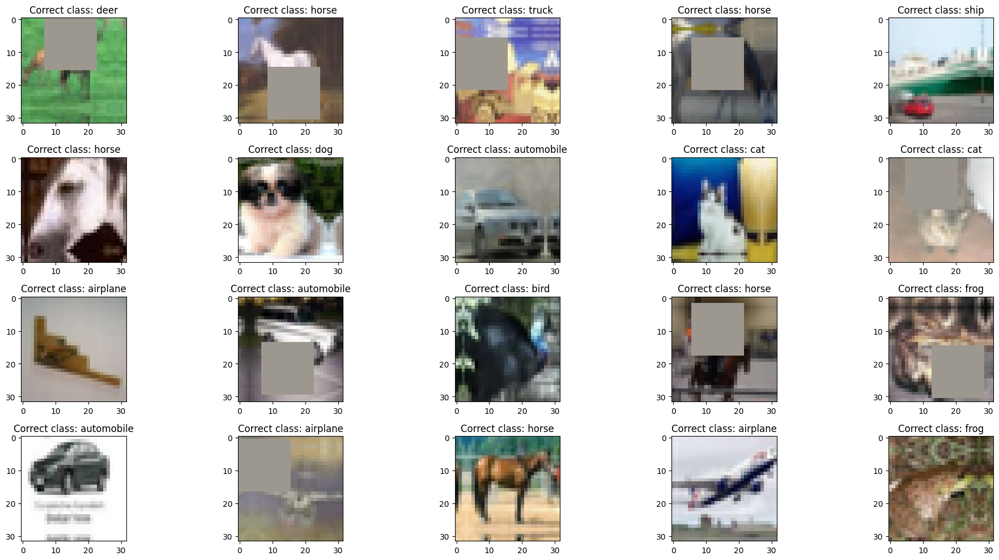
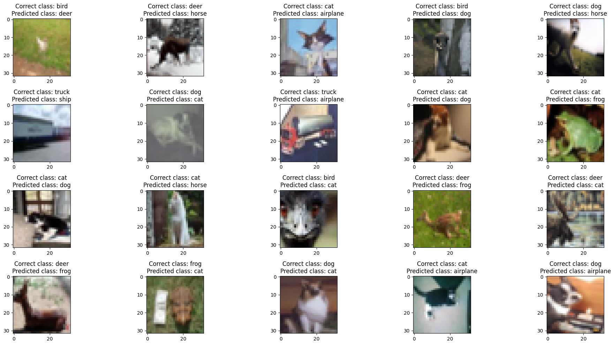
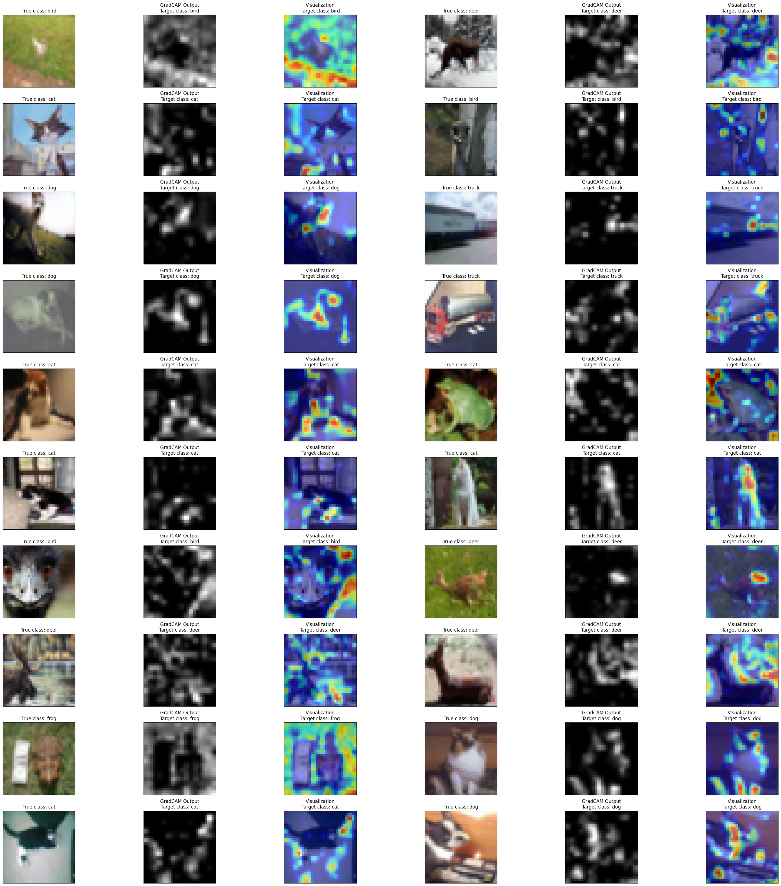
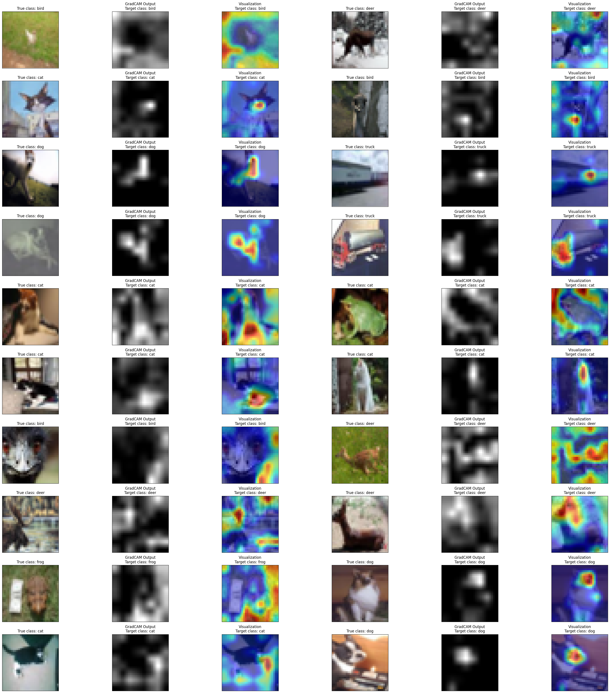
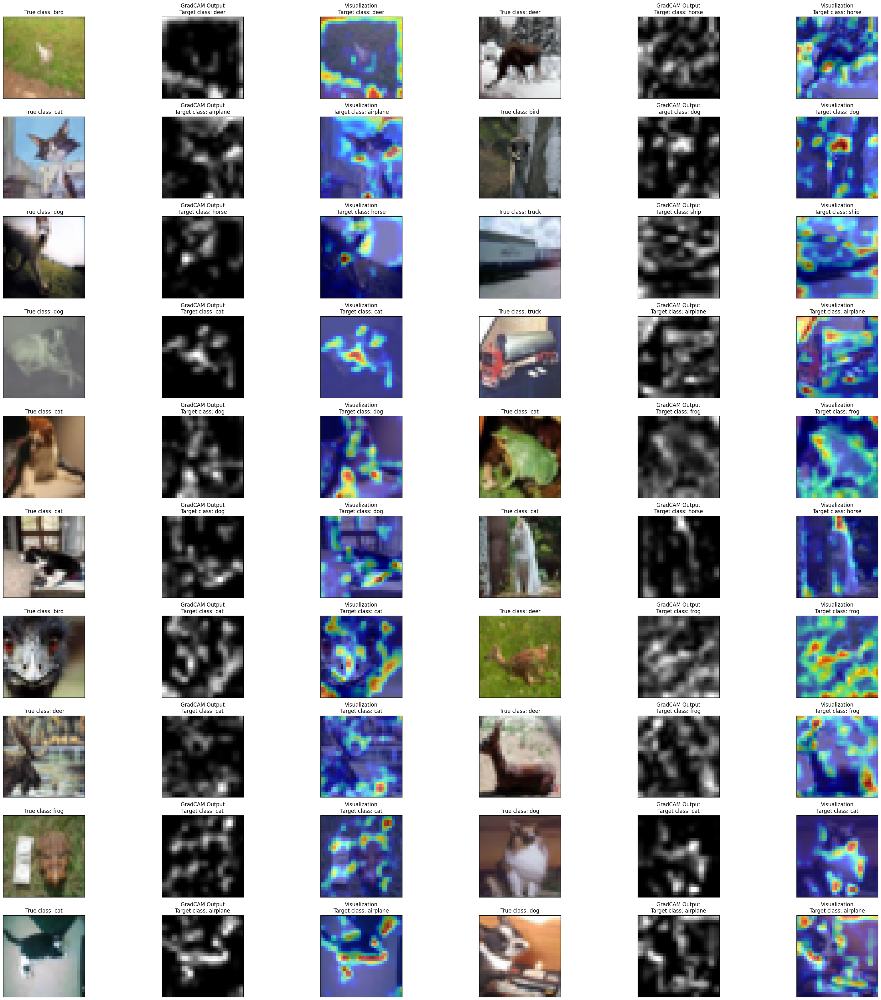
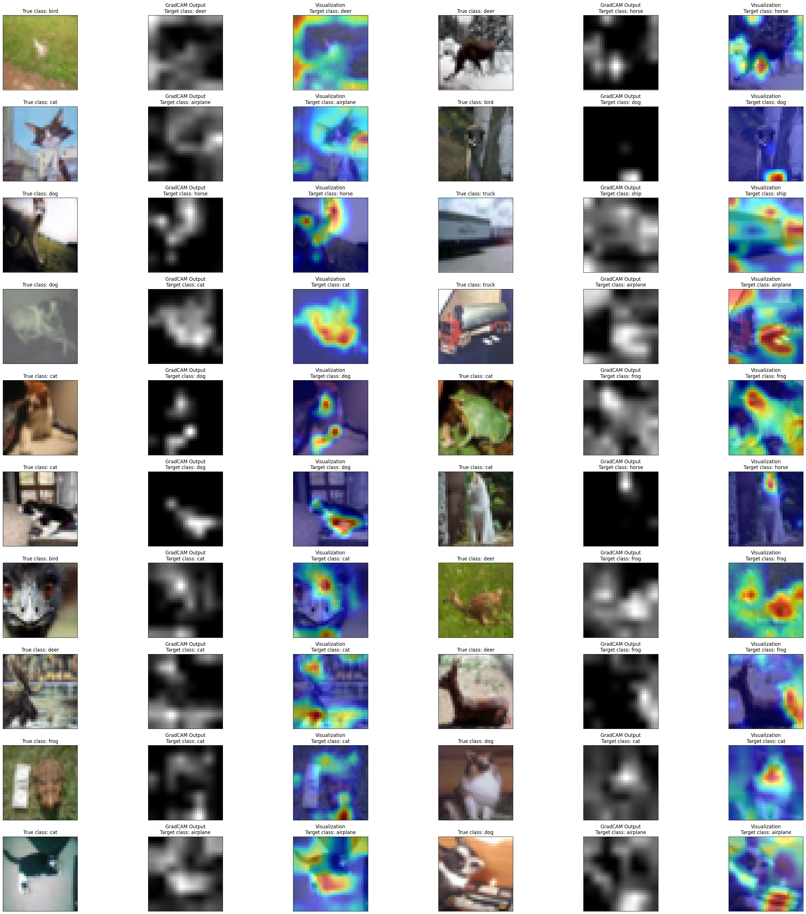
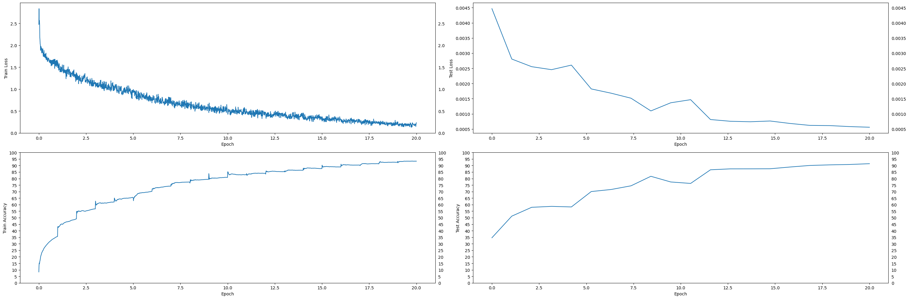
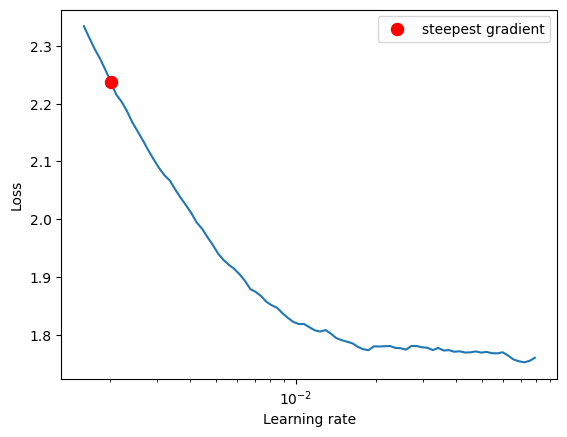
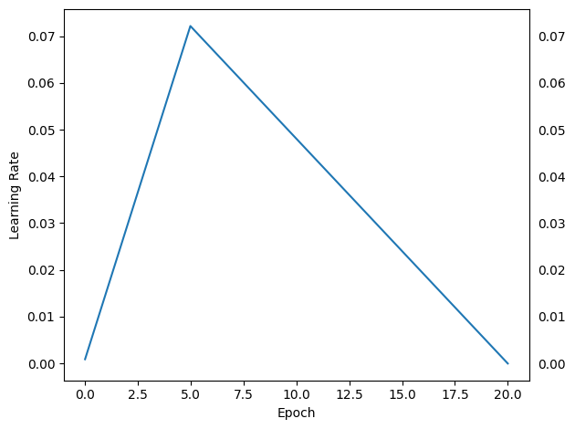

# **Assignment 11**

1.  Check this Repo out: https://github.com/kuangliu/pytorch-cifar
2.  (Optional) You are going to follow the same structure for your Code (as a reference). So Create:
    1. models folder - this is where you'll add all of your future models. Copy resnet.py into this folder, this file should only have ResNet 18/34 models. Delete Bottleneck Class
    2. main.py - from Google Colab, now onwards, this is the file that you'll import (along with the model). Your main file shall be able to take these params or you should be able to pull functions from it and then perform operations, like (including but not limited to):
       1. training and test loops
       2. data split between test and train
       3. epochs
       4. batch size
       5. which optimizer to run
       6. do we run a scheduler?
    3. utils.py file (or a folder later on when it expands) - this is where you will add all of your utilities like:
       1. image transforms,
       2. gradcam,
       3. misclassification code,
       4. tensorboard related stuff
       5. advanced training policies, etc
3.  Your assignment is to build the above training structure. Train ResNet18 on Cifar10 for 20 Epochs. The assignment must:

    1. pull your Github code to google colab (don't copy-paste code)
    2. prove that you are following the above structure
    3. that the code in your google collab notebook is NOTHING.. barely anything. There should not be any function or class that you can define in your Google Colab Notebook. Everything must be imported from all of your other files
    4. your colab file must:
       1. train resnet18 for 20 epochs on the CIFAR10 dataset
       2. show loss curves for test and train datasets
       3. show a gallery of 10 misclassified images
       4. show [gradcam](https://github.com/jacobgil/pytorch-grad-cam) output on 10 misclassified images. Remember if you are applying GradCAM on a channel that is less than 5px, then please don't bother to submit the assignment. 😡🤬🤬🤬🤬
       5. Once done, upload the code to GitHub, and share the code. This readme must link to the main repo so we can read your file structure.
       6. Train for 20 epochs
       7. Get 10 misclassified images
       8. Get 10 GradCam outputs on any misclassified images (remember that you MUST use the library we discussed in the class)
       9. Apply these transforms while training:
          1. RandomCrop(32, padding=4)
          2. CutOut(16x16)

4.  Assignment Submission Questions:
    1. Share the COMPLETE code of your model.py or the link for it
    2. Share the COMPLETE code of your utils.py or the link for it
    3. Share the COMPLETE code of your main.py or the link for it
    4. Copy-paste the training log (cannot be ugly)
    5. Copy-paste the 10/20 Misclassified Images Gallery
    6. Copy-paste the 10/20 GradCam outputs Gallery
    7. Share the link to your MAIN repo
    8. Share the link to your README of Assignment (cannot be in the MAIN Repo, but Assignment 11 repo)

## Solution

1. The repo with all the code: https://github.com/abhyuditjain/pytorch-models/
2. Notebook: `session_11.ipynb`

# Model Parameters

```
==============================================================================================================================================================================================
Layer (type (var_name))                  Kernel Shape              Input Shape               Output Shape              Param #                   Mult-Adds                 Trainable
==============================================================================================================================================================================================
ResNet (ResNet)                          --                        [20, 3, 32, 32]           [20, 10]                  --                        --                        True
├─Conv2d (conv1)                         [3, 3]                    [20, 3, 32, 32]           [20, 64, 32, 32]          1,728                     35,389,440                True
├─BatchNorm2d (bn1)                      --                        [20, 64, 32, 32]          [20, 64, 32, 32]          128                       2,560                     True
├─Sequential (layer1)                    --                        [20, 64, 32, 32]          [20, 64, 32, 32]          --                        --                        True
│    └─BasicBlock (0)                    --                        [20, 64, 32, 32]          [20, 64, 32, 32]          --                        --                        True
│    │    └─Conv2d (conv1)               [3, 3]                    [20, 64, 32, 32]          [20, 64, 32, 32]          36,864                    754,974,720               True
│    │    └─BatchNorm2d (bn1)            --                        [20, 64, 32, 32]          [20, 64, 32, 32]          128                       2,560                     True
│    │    └─Conv2d (conv2)               [3, 3]                    [20, 64, 32, 32]          [20, 64, 32, 32]          36,864                    754,974,720               True
│    │    └─BatchNorm2d (bn2)            --                        [20, 64, 32, 32]          [20, 64, 32, 32]          128                       2,560                     True
│    │    └─Sequential (shortcut)        --                        [20, 64, 32, 32]          [20, 64, 32, 32]          --                        --                        --
│    └─BasicBlock (1)                    --                        [20, 64, 32, 32]          [20, 64, 32, 32]          --                        --                        True
│    │    └─Conv2d (conv1)               [3, 3]                    [20, 64, 32, 32]          [20, 64, 32, 32]          36,864                    754,974,720               True
│    │    └─BatchNorm2d (bn1)            --                        [20, 64, 32, 32]          [20, 64, 32, 32]          128                       2,560                     True
│    │    └─Conv2d (conv2)               [3, 3]                    [20, 64, 32, 32]          [20, 64, 32, 32]          36,864                    754,974,720               True
│    │    └─BatchNorm2d (bn2)            --                        [20, 64, 32, 32]          [20, 64, 32, 32]          128                       2,560                     True
│    │    └─Sequential (shortcut)        --                        [20, 64, 32, 32]          [20, 64, 32, 32]          --                        --                        --
├─Sequential (layer2)                    --                        [20, 64, 32, 32]          [20, 128, 16, 16]         --                        --                        True
│    └─BasicBlock (0)                    --                        [20, 64, 32, 32]          [20, 128, 16, 16]         --                        --                        True
│    │    └─Conv2d (conv1)               [3, 3]                    [20, 64, 32, 32]          [20, 128, 16, 16]         73,728                    377,487,360               True
│    │    └─BatchNorm2d (bn1)            --                        [20, 128, 16, 16]         [20, 128, 16, 16]         256                       5,120                     True
│    │    └─Conv2d (conv2)               [3, 3]                    [20, 128, 16, 16]         [20, 128, 16, 16]         147,456                   754,974,720               True
│    │    └─BatchNorm2d (bn2)            --                        [20, 128, 16, 16]         [20, 128, 16, 16]         256                       5,120                     True
│    │    └─Sequential (shortcut)        --                        [20, 64, 32, 32]          [20, 128, 16, 16]         8,448                     41,948,160                True
│    └─BasicBlock (1)                    --                        [20, 128, 16, 16]         [20, 128, 16, 16]         --                        --                        True
│    │    └─Conv2d (conv1)               [3, 3]                    [20, 128, 16, 16]         [20, 128, 16, 16]         147,456                   754,974,720               True
│    │    └─BatchNorm2d (bn1)            --                        [20, 128, 16, 16]         [20, 128, 16, 16]         256                       5,120                     True
│    │    └─Conv2d (conv2)               [3, 3]                    [20, 128, 16, 16]         [20, 128, 16, 16]         147,456                   754,974,720               True
│    │    └─BatchNorm2d (bn2)            --                        [20, 128, 16, 16]         [20, 128, 16, 16]         256                       5,120                     True
│    │    └─Sequential (shortcut)        --                        [20, 128, 16, 16]         [20, 128, 16, 16]         --                        --                        --
├─Sequential (layer3)                    --                        [20, 128, 16, 16]         [20, 256, 8, 8]           --                        --                        True
│    └─BasicBlock (0)                    --                        [20, 128, 16, 16]         [20, 256, 8, 8]           --                        --                        True
│    │    └─Conv2d (conv1)               [3, 3]                    [20, 128, 16, 16]         [20, 256, 8, 8]           294,912                   377,487,360               True
│    │    └─BatchNorm2d (bn1)            --                        [20, 256, 8, 8]           [20, 256, 8, 8]           512                       10,240                    True
│    │    └─Conv2d (conv2)               [3, 3]                    [20, 256, 8, 8]           [20, 256, 8, 8]           589,824                   754,974,720               True
│    │    └─BatchNorm2d (bn2)            --                        [20, 256, 8, 8]           [20, 256, 8, 8]           512                       10,240                    True
│    │    └─Sequential (shortcut)        --                        [20, 128, 16, 16]         [20, 256, 8, 8]           33,280                    41,953,280                True
│    └─BasicBlock (1)                    --                        [20, 256, 8, 8]           [20, 256, 8, 8]           --                        --                        True
│    │    └─Conv2d (conv1)               [3, 3]                    [20, 256, 8, 8]           [20, 256, 8, 8]           589,824                   754,974,720               True
│    │    └─BatchNorm2d (bn1)            --                        [20, 256, 8, 8]           [20, 256, 8, 8]           512                       10,240                    True
│    │    └─Conv2d (conv2)               [3, 3]                    [20, 256, 8, 8]           [20, 256, 8, 8]           589,824                   754,974,720               True
│    │    └─BatchNorm2d (bn2)            --                        [20, 256, 8, 8]           [20, 256, 8, 8]           512                       10,240                    True
│    │    └─Sequential (shortcut)        --                        [20, 256, 8, 8]           [20, 256, 8, 8]           --                        --                        --
├─Sequential (layer4)                    --                        [20, 256, 8, 8]           [20, 512, 4, 4]           --                        --                        True
│    └─BasicBlock (0)                    --                        [20, 256, 8, 8]           [20, 512, 4, 4]           --                        --                        True
│    │    └─Conv2d (conv1)               [3, 3]                    [20, 256, 8, 8]           [20, 512, 4, 4]           1,179,648                 377,487,360               True
│    │    └─BatchNorm2d (bn1)            --                        [20, 512, 4, 4]           [20, 512, 4, 4]           1,024                     20,480                    True
│    │    └─Conv2d (conv2)               [3, 3]                    [20, 512, 4, 4]           [20, 512, 4, 4]           2,359,296                 754,974,720               True
│    │    └─BatchNorm2d (bn2)            --                        [20, 512, 4, 4]           [20, 512, 4, 4]           1,024                     20,480                    True
│    │    └─Sequential (shortcut)        --                        [20, 256, 8, 8]           [20, 512, 4, 4]           132,096                   41,963,520                True
│    └─BasicBlock (1)                    --                        [20, 512, 4, 4]           [20, 512, 4, 4]           --                        --                        True
│    │    └─Conv2d (conv1)               [3, 3]                    [20, 512, 4, 4]           [20, 512, 4, 4]           2,359,296                 754,974,720               True
│    │    └─BatchNorm2d (bn1)            --                        [20, 512, 4, 4]           [20, 512, 4, 4]           1,024                     20,480                    True
│    │    └─Conv2d (conv2)               [3, 3]                    [20, 512, 4, 4]           [20, 512, 4, 4]           2,359,296                 754,974,720               True
│    │    └─BatchNorm2d (bn2)            --                        [20, 512, 4, 4]           [20, 512, 4, 4]           1,024                     20,480                    True
│    │    └─Sequential (shortcut)        --                        [20, 512, 4, 4]           [20, 512, 4, 4]           --                        --                        --
├─Linear (linear)                        --                        [20, 512]                 [20, 10]                  5,130                     102,600                   True
==============================================================================================================================================================================================
Total params: 11,173,962
Trainable params: 11,173,962
Non-trainable params: 0
Total mult-adds (G): 11.11
==============================================================================================================================================================================================
Input size (MB): 0.25
Forward/backward pass size (MB): 196.61
Params size (MB): 44.70
Estimated Total Size (MB): 241.55
==============================================================================================================================================================================================
```

# Notes

1. Trained for 20 epochs
2. Used **Adam** optimizer (`lr=1e-3, weight_decay = 1e-7`)
3. Used **LRFinder** with (`end_lr=0.1, num_iter=100, step_mode='exp'`)
   - Min Loss = `1.753086244055849`
   - Max LR = `0.07220809018385464`
4. Used **CrossEntropyLoss**
5. Used **OneCycleLR** scheduler with (`max_lr=max_lr, pct_start=5/EPOCHS, div_factor=100, three_phase=False, final_div_factor=100, anneal_strategy='linear'`)

# Results

1. Max Accuracy = `91.38%` at Epoch 20
2. Max LR = `0.07220809018385464`
3. Min LR = `-4.18954286515727e-05`

# Sample Training Images



# Misclassified Images



# Misclassified Images Grad-CAM

## vs Correct class

This is what the model sees for the correct class, but it's not enough for it to predict it.

### **Layer 2**



### **Layer 3**



## vs Predicted class

This is what the model sees that it based its prediction on.

### **Layer 2**



### **Layer 3**



# Loss and Accuracy Graphs



# LR Finder Graph



# Training LR History Graph



# Training logs (20 epochs)

```
EPOCH = 1 | LR = 0.015048520389849952 | Loss = 1.53 | Batch = 97 | Accuracy = 35.60: 100%|██████████| 98/98 [00:26<00:00,  3.63it/s]
Test set: Average loss: 0.0045, Accuracy: 3459/10000 (34.59%)

EPOCH = 2 | LR = 0.029374959877861356 | Loss = 1.34 | Batch = 97 | Accuracy = 49.09: 100%|██████████| 98/98 [00:27<00:00,  3.54it/s]
Test set: Average loss: 0.0028, Accuracy: 5117/10000 (51.17%)

EPOCH = 3 | LR = 0.043701399365872765 | Loss = 1.12 | Batch = 97 | Accuracy = 56.74: 100%|██████████| 98/98 [00:27<00:00,  3.54it/s]
Test set: Average loss: 0.0026, Accuracy: 5795/10000 (57.95%)

EPOCH = 4 | LR = 0.05802783885388417 | Loss = 1.07 | Batch = 97 | Accuracy = 62.05: 100%|██████████| 98/98 [00:27<00:00,  3.55it/s]
Test set: Average loss: 0.0025, Accuracy: 5866/10000 (58.66%)

EPOCH = 5 | LR = 0.07215897394618469 | Loss = 0.92 | Batch = 97 | Accuracy = 65.54: 100%|██████████| 98/98 [00:27<00:00,  3.53it/s]
Test set: Average loss: 0.0026, Accuracy: 5823/10000 (58.23%)

EPOCH = 6 | LR = 0.06734558265452893 | Loss = 0.69 | Batch = 97 | Accuracy = 70.21: 100%|██████████| 98/98 [00:28<00:00,  3.50it/s]
Test set: Average loss: 0.0018, Accuracy: 7003/10000 (70.03%)

EPOCH = 7 | LR = 0.06253219136287319 | Loss = 0.81 | Batch = 97 | Accuracy = 74.18: 100%|██████████| 98/98 [00:27<00:00,  3.54it/s]
Test set: Average loss: 0.0017, Accuracy: 7160/10000 (71.60%)

EPOCH = 8 | LR = 0.057718800071217435 | Loss = 0.65 | Batch = 97 | Accuracy = 77.27: 100%|██████████| 98/98 [00:27<00:00,  3.55it/s]
Test set: Average loss: 0.0015, Accuracy: 7442/10000 (74.42%)

EPOCH = 9 | LR = 0.05290540877956168 | Loss = 0.57 | Batch = 97 | Accuracy = 79.43: 100%|██████████| 98/98 [00:27<00:00,  3.55it/s]
Test set: Average loss: 0.0011, Accuracy: 8172/10000 (81.72%)

EPOCH = 10 | LR = 0.04809201748790593 | Loss = 0.51 | Batch = 97 | Accuracy = 80.88: 100%|██████████| 98/98 [00:27<00:00,  3.55it/s]
Test set: Average loss: 0.0014, Accuracy: 7737/10000 (77.37%)

EPOCH = 11 | LR = 0.04327862619625018 | Loss = 0.48 | Batch = 97 | Accuracy = 82.91: 100%|██████████| 98/98 [00:27<00:00,  3.53it/s]
Test set: Average loss: 0.0015, Accuracy: 7625/10000 (76.25%)

EPOCH = 12 | LR = 0.03846523490459443 | Loss = 0.46 | Batch = 97 | Accuracy = 84.01: 100%|██████████| 98/98 [00:27<00:00,  3.53it/s]
Test set: Average loss: 0.0008, Accuracy: 8671/10000 (86.71%)

EPOCH = 13 | LR = 0.03365184361293868 | Loss = 0.44 | Batch = 97 | Accuracy = 85.29: 100%|██████████| 98/98 [00:27<00:00,  3.52it/s]
Test set: Average loss: 0.0008, Accuracy: 8742/10000 (87.42%)

EPOCH = 14 | LR = 0.02883845232128293 | Loss = 0.46 | Batch = 97 | Accuracy = 86.35: 100%|██████████| 98/98 [00:26<00:00,  3.69it/s]
Test set: Average loss: 0.0007, Accuracy: 8744/10000 (87.44%)

EPOCH = 15 | LR = 0.024025061029627176 | Loss = 0.38 | Batch = 97 | Accuracy = 87.66: 100%|██████████| 98/98 [00:26<00:00,  3.68it/s]
Test set: Average loss: 0.0008, Accuracy: 8750/10000 (87.50%)

EPOCH = 16 | LR = 0.019211669737971428 | Loss = 0.30 | Batch = 97 | Accuracy = 88.90: 100%|██████████| 98/98 [00:26<00:00,  3.68it/s]
Test set: Average loss: 0.0007, Accuracy: 8883/10000 (88.83%)

EPOCH = 17 | LR = 0.01439827844631568 | Loss = 0.30 | Batch = 97 | Accuracy = 90.30: 100%|██████████| 98/98 [00:26<00:00,  3.69it/s]
Test set: Average loss: 0.0006, Accuracy: 9003/10000 (90.03%)

EPOCH = 18 | LR = 0.009584887154659924 | Loss = 0.26 | Batch = 97 | Accuracy = 91.40: 100%|██████████| 98/98 [00:26<00:00,  3.68it/s]
Test set: Average loss: 0.0006, Accuracy: 9048/10000 (90.48%)

EPOCH = 19 | LR = 0.004771495863004183 | Loss = 0.20 | Batch = 97 | Accuracy = 92.47: 100%|██████████| 98/98 [00:26<00:00,  3.67it/s]
Test set: Average loss: 0.0006, Accuracy: 9078/10000 (90.78%)

EPOCH = 20 | LR = -4.18954286515727e-05 | Loss = 0.23 | Batch = 97 | Accuracy = 93.32: 100%|██████████| 98/98 [00:26<00:00,  3.68it/s]
Test set: Average loss: 0.0006, Accuracy: 9138/10000 (91.38%)
```
